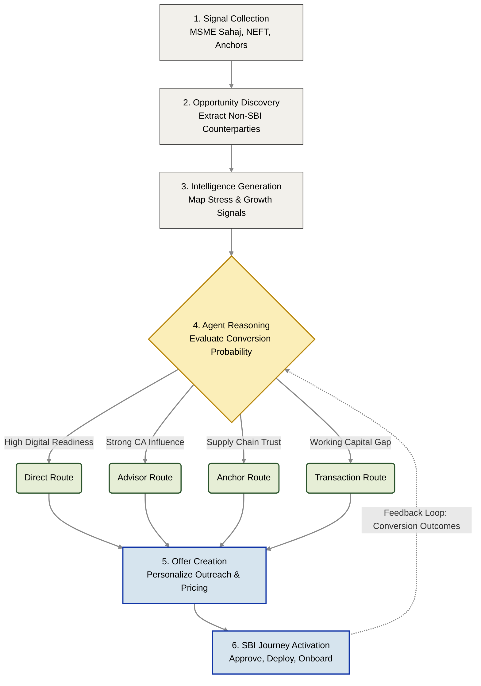

# Sahaj PathFinder
**Agentic MSME Acquisition Intelligence Engine**

> ### *"Every MSME Enters SBI Through a Different Door."*

---

> [!NOTE]
> ### PHASE 1: IDEATION & BLUEPRINTS `[COMPLETED]`
> * **Problem Definition** &bull; _Strategic SBI alignment locked._
> * **Product Design** &bull; _Acquisition routes and PDD finalized._
> * **Architecture** &bull; _LangGraph orchestration mapped._
> * **UI Prototype** &bull; _High-fidelity executive screens built._
> * **Synthetic Dataset** &bull; _12 relational DB tables generated._

> [!TIP]
> ### PHASE 2: HACKATHON SPRINT `[NEXT]`
> * **MVP Development** &bull; _Next.js SPA frontend initialization._
> * **Backend Core** &bull; _FastAPI endpoints & data ingestion._
> * **Agent Engine** &bull; _Multi-LLM reasoning & tool binding._
> * **Deployment** &bull; _Cloud hosting & demo environment._

---

## 30-Second Executive Summary
State Bank of India possesses massive amounts of transaction and supply-chain data via **MSME Sahaj**, **YONO Business**, and corporate ledgers. Yet, customer acquisition remains a manual, outbound, "one-size-fits-all" process.

**Sahaj PathFinder** is an Agentic AI orchestration platform that autonomously discovers un-banked MSMEs hiding within SBI's existing network. Instead of blindly scoring leads, the PathFinder Agent mathematically reasons through a prospect's operational friction (e.g., cash flow stress, advisor dependency) to determine the exact product, message, and **Acquisition Route** required to convert them. 

---

## The Core Insight: Who vs. How

Most banking CRMs are built on a flawed premise: they optimize for ***Who*** to target. PathFinder optimizes for ***How*** to acquire them.

| Traditional Lead Scoring (Static) | Sahaj PathFinder (Agentic) |
| :--- | :--- |
| **Asks:** *"Who has the highest lead score?"* | **Asks:** *"Which pathway will convert this MSME?"* |
| **Workflow:** `Input` → `Score` → `Push to CRM` | **Workflow:** `Discover` → `Reason` → `Simulate Routes` → `Execute` |
| **Assumption:** One marketing pitch fits all. | **Reality:** Motivation dictates the acquisition channel. |

---

## The 4 Autonomous Acquisition Routes

When PathFinder discovers a new MSME in the ecosystem, the Agent evaluates four distinct conversion pathways before taking action:

1. **Transaction Route:** Deployed when liquidity stress is detected. *(Transforms an unpaid invoice into an instant SBI financing pull).*
2. **Advisor Route:** Deployed when CA/Tax Consultant influence is strong. *(Bypasses cold outreach by pitching via the trusted advisor).*
3. **Anchor Route:** Deployed for deep supply chains. *(Subsidizes acquisition through an existing Tier-1 SBI corporate relationship).*
4. **Direct Route:** Deployed when digital readiness is exceptionally high. *(Triggers self-serve YONO Business onboarding).*

---

## System Architecture

PathFinder shifts SBI from a reactive lead generator to a proactive, continuously learning network.

*For deeper technical implementation details, see [`Architecture Explanation`](./architecture/architecture_explanation.md).*

---

## Prototype UI & Capabilities

The repository contains high-fidelity UI screens demonstrating the end-to-end executive workflow:

* **[Screen 1: Discovery Dashboard](./prototype/screen_01_dashboard.png)** - Tracks macro network growth and discovers MSME opportunities hidden within SBI ecosystems.
* **[Screen 2: Acquisition Intelligence](./prototype/screen_02_acquisition_intelligence.png)** - Exposes the AI's internal logic, signal analysis, and comparative route evaluation.
* **[Screen 3: Offer Workspace](./prototype/screen_03_offer_workspace.png)** - The RM interface to review the generated strategy, verify compliance, and launch the journey.
* **[Screen 4: Impact Center](./prototype/screen_04_impact_center.png)** - Tracks conversion outcomes, loan book expansion, and the agent's continuous learning loop.

---

## SBI Business Impact

* **Customer Acquisition:** Drastically reduces Customer Acquisition Cost (CAC) by converting transactional friction into warm inbound leads.
* **Digital Adoption:** Forces multi-product adoption by linking immediate liquidity to **MSME Sahaj** and **YONO Business** onboarding.
* **Ecosystem Expansion:** Creates a geometric growth loop where every newly acquired MSME exposes their own ledger of sub-suppliers to the Discovery Engine.

---

## Repository Structure

### Project Directory Structure

[<kbd>**sahaj-pathfinder/**</kbd>](./)  
&nbsp;&nbsp;├── [<kbd>**architecture/**</kbd>](./architecture/) _(Technical Blueprints)_  
&nbsp;&nbsp;│&nbsp;&nbsp;&nbsp;&nbsp;&nbsp;├── [<kbd>architecture.md</kbd>](./architecture/architecture.md)  
&nbsp;&nbsp;│&nbsp;&nbsp;&nbsp;&nbsp;&nbsp;├── [<kbd>architecture_explanation.md</kbd>](./architecture/architecture_explanation.md)  
&nbsp;&nbsp;│&nbsp;&nbsp;&nbsp;&nbsp;&nbsp;└── [<kbd>sahaj_pathfinder_architecture.jpg</kbd>](./architecture/sahaj_pathfinder_architecture.jpg)  
&nbsp;&nbsp;├── [<kbd>**docs/**</kbd>](./docs/) _(Core Product Documentation)_  
&nbsp;&nbsp;│&nbsp;&nbsp;&nbsp;&nbsp;&nbsp;├── [<kbd>Problem_Statement.md</kbd>](./docs/Problem_Statement.md)  
&nbsp;&nbsp;│&nbsp;&nbsp;&nbsp;&nbsp;&nbsp;└── [<kbd>Product_Definition_Document.md</kbd>](./docs/Product_Definition_Document.md)  
&nbsp;&nbsp;├── [<kbd>**presentation/**</kbd>](./presentation/) _(Executive Pitch Materials)_  
&nbsp;&nbsp;│&nbsp;&nbsp;&nbsp;&nbsp;&nbsp;├── [<kbd>Demo_Storyboard.md</kbd>](./presentation/Demo_Storyboard.md)  
&nbsp;&nbsp;│&nbsp;&nbsp;&nbsp;&nbsp;&nbsp;└── [<kbd>Sahaj_PathFinder_Pitch_Deck.pdf</kbd>](./presentation/Sahaj_PathFinder_Pitch_Deck.pdf)  
&nbsp;&nbsp;├── [<kbd>**prototype/**</kbd>](./prototype/) _(High-Fidelity UI Workflows)_  
&nbsp;&nbsp;│&nbsp;&nbsp;&nbsp;&nbsp;&nbsp;├── [<kbd>screen_01_dashboard.png</kbd>](./prototype/screen_01_dashboard.png)  
&nbsp;&nbsp;│&nbsp;&nbsp;&nbsp;&nbsp;&nbsp;├── [<kbd>screen_02_acquisition_intelligence.png</kbd>](./prototype/screen_02_acquisition_intelligence.png)  
&nbsp;&nbsp;│&nbsp;&nbsp;&nbsp;&nbsp;&nbsp;├── [<kbd>screen_03_offer_workspace.png</kbd>](./prototype/screen_03_offer_workspace.png)  
&nbsp;&nbsp;│&nbsp;&nbsp;&nbsp;&nbsp;&nbsp;└── [<kbd>screen_04_impact_center.png</kbd>](./prototype/screen_04_impact_center.png)  
&nbsp;&nbsp;├── [<kbd>**sample_data/**</kbd>](./sample_data/) _(Synthetic Datasets & Schemas)_  
&nbsp;&nbsp;│&nbsp;&nbsp;&nbsp;&nbsp;&nbsp;├── [<kbd>01_msme_profiles.csv</kbd>](./sample_data/01_msme_profiles.csv)  
&nbsp;&nbsp;│&nbsp;&nbsp;&nbsp;&nbsp;&nbsp;├── [<kbd>02_invoice_transactions.csv</kbd>](./sample_data/02_invoice_transactions.csv)  
&nbsp;&nbsp;│&nbsp;&nbsp;&nbsp;&nbsp;&nbsp;├── <kbd>... (12 modular relational datasets)</kbd>  
&nbsp;&nbsp;│&nbsp;&nbsp;&nbsp;&nbsp;&nbsp;└── [<kbd>README.md</kbd>](./sample_data/README.md) _(Data dictionary & schema mapping)_  
&nbsp;&nbsp;└── <kbd>**README.md**</kbd> **← You are here**

---

## Next Steps

To understand how Sahaj PathFinder bridges the gap between abstract AI and aggressive commercial banking growth, **start here:**

* **For Business Judges:** **[View the Executive Pitch Deck](./presentation/Sahaj_PathFinder_Pitch_Deck.pdf)** and the **[Demo Storyboard](./presentation/Demo_Storyboard.md)**
* **For Technical Judges:** Review my **[Proposed Technology Stack](./docs/Technology_Stack.md)** and the aggressive 30-day **[Implementation Roadmap](./docs/Implementation_Roadmap.md)** for Phase 2.

---

*Built for the SBI Global Fintech Fest 2026 | Theme: Agentic AI & Emerging Technology*