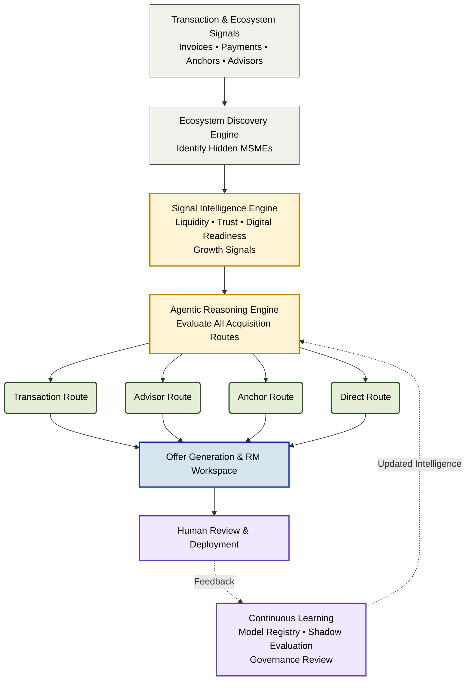

<p align="center">
  
</p>

<h1 align="center" id="top">Sahaj PathFinder</h1>

<p align="center">
<b>Agentic MSME Acquisition Intelligence Engine</b><br>
Turning SBI's existing transaction ecosystem into its next customer acquisition channel.
</p>

<p align="center">

<a href="https://hackculture.io/hackathons/sbi-hackathon-gff-2026">

</a>

<a href="https://hackculture.io/hackathons/sbi-hackathon-gff-2026">

</a>

<a href="https://hackculture.io/hackathons/sbi-hackathon-gff-2026">

</a>

</p>

<p align="center">

<a href="#experience-sahaj-pathfinder">Experience</a>
•
<a href="#30-second-executive-scan">Executive Scan</a>
•
<a href="#the-core-insight">Core Insight</a>
•
<a href="#platform-experience">Prototype</a>
•
<a href="#enterprise-ai-principles">Enterprise AI</a>
•
<a href="#from-prototype-to-production">Production</a>
•
<a href="#repository-documentation">Documentation</a>
•
<a href="#repository-structure">Repository</a>
•
<a href="#running-the-prototype-locally">Run Locally</a>

</p>

---

> [!TIP]
> **New here?**
>
> Watch the interactive walkthrough below. In under two minutes you will understand the complete acquisition lifecycle before diving into the technical details.

<br>

# Experience Sahaj PathFinder

<p align="center">


</p>

<p align="center">

<i>95-second end-to-end walkthrough demonstrating the complete acquisition lifecycle:</i><br>
<b>`Discovery Dashboard` → `Acquisition Intelligence` → `Offer Workspace` → `Impact Center` → `Architecture Explorer`</b>

</p>

<p align="center">

<a href="YOUR_YOUTUBE_LINK">

</a>

</p>

<p align="right">
  <a href="#top"><sub><b>BACK TO TOP</b></sub></a>
</p>

---

# 30-Second Executive Scan

| | |
|:--|:--|
| **Problem** | MSME acquisition is largely outbound, manual, and follows a one-size-fits-all process despite SBI possessing rich transaction and ecosystem intelligence. |
| **Core Idea** | PathFinder discovers hidden MSMEs inside SBI's existing ecosystem and determines the optimal acquisition pathway for each business instead of assigning a generic lead score. |
| **Innovation** | Explainable, governed acquisition intelligence combining ecosystem discovery, route reasoning, offer generation, and continuous learning. |
| **Prototype** | Interactive production-style prototype built with Next.js and FastAPI using a synthetic relational banking dataset. |
| **Differentiator** | Every recommendation is fully explainable, continuously evaluated, human-governed, and designed for enterprise deployment rather than black-box automation. |
| **Built For** | SBI Global Fintech Fest 2026 - Agentic AI & Emerging Technology |

<p align="right">
  <a href="#top"><sub><b>BACK TO TOP</b></sub></a>
</p>

---

# The Core Insight

Traditional banking CRMs optimize **who** should be contacted next.

Sahaj PathFinder optimizes **how** a business should be acquired.

That distinction changes customer acquisition from a lead scoring problem into an acquisition strategy problem.

Instead of assigning a single score to every prospect, PathFinder reasons about **why an MSME exists inside SBI's ecosystem, what business signals it exhibits, and which acquisition pathway is most likely to convert it.**

<br>

| Traditional Lead Scoring | Sahaj PathFinder |
| :---------------------- | :--------------- |
| **Question** | *Who should Relationship Managers call next?* | *How should this MSME enter SBI?* |
| **Input** | CRM attributes & historical interactions | Transaction graph, ecosystem relationships, business signals & network intelligence |
| **Decision** | Static lead score | Dynamic acquisition pathway |
| **Recommendation** | Same outreach process for every lead | Personalized acquisition strategy for every business |
| **Outcome** | Higher outreach volume | Higher conversion probability with lower acquisition cost |

---

## Every MSME Enters SBI Through a Different Door.

Rather than forcing every business through the same onboarding funnel, PathFinder evaluates multiple acquisition pathways before recommending a strategy.

| Acquisition Route | When It Is Recommended |
| :---------------- | :--------------------- |
| **Transaction Route** | Working capital pressure indicates invoice financing or liquidity products will create immediate value. |
| **Advisor Route** | Strong CA or tax advisor influence makes trusted-channel acquisition more effective than direct outreach. |
| **Anchor Route** | Existing corporate relationships can introduce suppliers through trusted supply-chain connections. |
| **Direct Route** | High digital maturity makes self-service onboarding through SBI's digital channels the fastest path. |

> [!IMPORTANT]
> **The objective is not to predict who will become a customer.**
>
> The objective is to determine **which acquisition pathway gives each MSME the highest probability of becoming a customer.**

<p align="right">
  <a href="#top"><sub><b>BACK TO TOP</b></sub></a>
</p>

---

# How Sahaj PathFinder Works

Every recommendation produced by PathFinder follows the same governed intelligence pipeline.

Rather than sending raw banking data directly into an AI model, the platform progressively transforms transactional signals into explainable acquisition decisions through six distinct intelligence layers.

Each stage enriches the previous one, ensuring that every recommendation remains traceable, explainable, and suitable for enterprise banking.



---

## Enterprise AI Principles

PathFinder was intentionally designed as a **governed enterprise AI system**, not an autonomous black-box agent.

Every recommendation follows these principles:

| Principle | Implementation |
| :--------- | :------------- |
| **Explainable** | Every recommendation exposes supporting signals, feature contributions, formulas, and source datasets through the Signal Provenance Engine. |
| **Human-in-the-Loop** | Relationship Managers approve, reject, or modify recommendations before execution. |
| **Governed** | Candidate models are validated through offline testing and shadow deployment before promotion to production. |
| **Auditable** | Model versions, recommendation history, overrides, approvals, and deployment decisions remain fully traceable. |
| **Continuously Learning** | Customer outcomes and RM decisions become supervised feedback used for future model improvement under governance controls. |

> [!NOTE]
> The current repository demonstrates these enterprise workflows through an interactive production-style prototype. The recommendation engine uses deterministic business rules to ensure complete explainability today, while the architecture is intentionally designed to evolve toward governed agentic orchestration without changing the surrounding platform.

---

# Platform Experience

Rather than demonstrating isolated screens, Sahaj PathFinder was built as a continuous enterprise workflow.

Each workspace represents one stage of the MSME acquisition lifecycle, allowing judges to experience how discovery evolves into intelligence, intelligence into action, and action into measurable business impact.

<p align="right">
  <a href="#top"><sub><b>BACK TO TOP</b></sub></a>
</p>

---

## End-to-End Journey

| Workspace | Purpose | Key Capabilities |
|:-----------|:--------|:-----------------|
| **Discovery Dashboard** | Monitor SBI's acquisition pipeline and ecosystem growth. | Live opportunity queue, ecosystem expansion, route distribution, discovery timeline, executive KPIs. |
| **Acquisition Intelligence** | Explain *why* a business was discovered and *why* a specific acquisition pathway was recommended. | Signal Provenance Engine, discovery scoring, explainable feature contributions, route comparison, ecosystem graph, decision history. |
| **Offer Workspace** | Review AI-generated acquisition strategies before customer engagement. | Personalized offers, compliance validation, outreach generation, deployment workflow, relationship manager approvals. |
| **Impact Center** | Measure commercial outcomes and monitor AI performance. | Portfolio growth, acquisition metrics, learning pipeline, model registry, governance dashboard, continuous improvement. |
| **Architecture Explorer** *(Judges Only)* | Explore the internal architecture behind every recommendation. | Interactive reasoning pipeline, technology stack, dataset explorer, simulation playground, production migration strategy. |

---

## Designed for Enterprise Banking

The prototype intentionally mirrors how a Relationship Manager would interact with an enterprise banking platform.

Instead of showcasing isolated AI capabilities, every workspace answers a different business question:

| Business Question | Workspace |
|:------------------|:----------|
| **Where are our next customers hiding?** | Discovery Dashboard |
| **Why should we pursue this business?** | Acquisition Intelligence |
| **What should we offer them?** | Offer Workspace |
| **Did the strategy create business value?** | Impact Center |
| **Can we trust the AI?** | Architecture Explorer |

> [!TIP]
> Every recommendation shown throughout the prototype is connected to the same synthetic banking ecosystem, allowing judges to follow one MSME through the complete acquisition journey: From ecosystem discovery to governed deployment and continuous learning.

<p align="right">
  <a href="#top"><sub><b>BACK TO TOP</b></sub></a>
</p>

---

# Enterprise AI Principles

Most AI acquisition systems stop after generating a recommendation.

Sahaj PathFinder was intentionally designed to continue beyond recommendation generation by incorporating enterprise governance, explainability, human oversight, and continuous improvement into the decision lifecycle.

The objective is not simply to build a more intelligent model.

The objective is to build an AI system that a regulated financial institution can trust.

---

## What Makes PathFinder Enterprise-Ready?

| Principle | How PathFinder Implements It |
|:-----------|:-----------------------------|
| **Signal Provenance** | Every recommendation can be traced back to the exact source datasets, derived signals, supporting records, feature contributions, and reasoning formulas through the Signal Provenance Engine. |
| **Explainable Decisions** | Relationship Managers can inspect why a business was discovered, why alternative routes were rejected, and why the selected acquisition pathway received the highest confidence. |
| **Human-in-the-Loop** | AI proposes acquisition strategies. Relationship Managers remain responsible for reviewing, approving, modifying, or rejecting recommendations before deployment. |
| **Governed Continuous Learning** | Customer outcomes, RM overrides, and campaign performance become supervised feedback for future model improvement instead of allowing autonomous self-learning. |
| **Shadow Deployment** | Candidate models are evaluated silently against production recommendations before promotion, ensuring measurable improvements without operational risk. |
| **Model Registry & Rollback** | Every deployed model is versioned, auditable, reversible, and accompanied by governance metadata documenting approval history and validation results. |

---

## Continuous Learning Without Losing Control

Unlike conventional machine learning systems that periodically retrain on historical data, PathFinder continuously captures operational feedback generated during everyday banking activities.

**<kbd>RECOMMENDATION</kbd>** ➔ **<kbd>RM_DECISION</kbd>** ➔ **<kbd>CUSTOMER_RESPONSE</kbd>** ➔ **<kbd>LOAN_OUTCOME</kbd>** ➔ **<kbd>FEEDBACK_REPO</kbd>** ➔ **<kbd>MODEL_TRAINING</kbd>** ➔ **<kbd>OFFLINE_VALIDATION</kbd>** ➔ **<kbd>SHADOW_EVAL</kbd>** ➔ **<kbd>GOVERNANCE</kbd>** ➔ **<kbd>DEPLOYMENT</kbd>**

At no point does the system automatically replace a production model.

Every promotion requires validation, governance approval, version tracking, and rollback capability.

> [!IMPORTANT]
> **The current prototype intentionally uses deterministic business rules rather than opaque AI predictions.**
>
> This guarantees complete explainability throughout the prototype while demonstrating an architecture that can progressively evolve toward governed agentic orchestration using enterprise-grade LLMs and graph intelligence.

<p align="right">
  <a href="#top"><sub><b>BACK TO TOP</b></sub></a>
</p>

---

# From Prototype to Production

Sahaj PathFinder was intentionally designed as an enterprise-first platform.

The current repository demonstrates a governed prototype, but the surrounding architecture supports incremental adoption inside an existing banking ecosystem without requiring a complete platform replacement.

---

## Production Evolution Strategy

| Phase | Objective | Primary Deliverables |
|:------|:----------|:---------------------|
| **Phase 1 - Prototype** | Demonstrate the complete acquisition lifecycle. | Interactive prototype, explainability engine, governance workflow, synthetic ecosystem. |
| **Phase 2 - Pilot Deployment** | Validate acquisition recommendations using historical SBI datasets. | Offline replay, feature calibration, model benchmarking, shadow evaluation. |
| **Phase 3 - Controlled Production** | Assist Relationship Managers without automating decisions. | Human approvals, production monitoring, recommendation audit trails. |
| **Phase 4 - Enterprise Scale** | Expand discovery across multiple SBI ecosystems. | Graph intelligence, governed LLM orchestration, portfolio-wide acquisition intelligence, continuous learning. |

---

## Why This Architecture Can Scale

Unlike a traditional proof-of-concept, the platform separates business workflows from AI implementation.

That means each capability can evolve independently without redesigning the overall product.

| Platform Layer | Future Evolution |
|:---------------|:-----------------|
| **Signal Collection** | Real-time banking events, transaction streams, Data Cloud integration. |
| **Discovery Engine** | Enterprise graph databases, ecosystem relationship expansion, streaming graph updates. |
| **Reasoning Engine** | Governed multi-agent orchestration using LangGraph and enterprise LLMs. |
| **Offer Intelligence** | Dynamic pricing, policy-aware product recommendations, customer-specific personalization. |
| **Learning Pipeline** | Automated offline evaluation, shadow deployment, continuous governance, versioned model registry. |

<p align="right">
  <a href="#top"><sub><b>BACK TO TOP</b></sub></a>
</p>

---

# Repository Documentation

The repository is intentionally organized for two audiences.

| If you're a... | Start Here |
|:---------------|:-----------|
| **Business Judge** | Pitch Deck → Demo GIF → Product Definition Document |
| **Technical Judge** | Architecture → Technology Stack → Implementation Roadmap |
| **Developer** | Source Code → Sample Dataset → Interactive Prototype |

<p align="right">
  <a href="#top"><sub><b>BACK TO TOP</b></sub></a>
</p>

---

# Repository Structure

<details>
<summary><b>Click to expand Repository Structure</b></summary>

[<kbd>**sahaj-pathfinder/**</kbd>](./)  
&nbsp;&nbsp;├── [<kbd>**architecture/**</kbd>](./architecture/) _(Technical Blueprints)_  
&nbsp;&nbsp;│&nbsp;&nbsp;&nbsp;&nbsp;&nbsp;├── [<kbd>architecture.md</kbd>](./architecture/architecture.md)  
&nbsp;&nbsp;│&nbsp;&nbsp;&nbsp;&nbsp;&nbsp;├── [<kbd>architecture_explanation.md</kbd>](./architecture/architecture_explanation.md)  
&nbsp;&nbsp;│&nbsp;&nbsp;&nbsp;&nbsp;&nbsp;└── [<kbd>sahaj_pathfinder_architecture.jpg</kbd>](./architecture/sahaj_pathfinder_architecture.jpg)  
&nbsp;&nbsp;├── [<kbd>**backend/**</kbd>](./backend/) _(FastAPI Services & APIs)_  
&nbsp;&nbsp;├── [<kbd>**docs/**</kbd>](./docs/) _(Core Product Documentation)_  
&nbsp;&nbsp;│&nbsp;&nbsp;&nbsp;&nbsp;&nbsp;├── [<kbd>Problem_Statement.md</kbd>](./docs/Problem_Statement.md)  
&nbsp;&nbsp;│&nbsp;&nbsp;&nbsp;&nbsp;&nbsp;├── [<kbd>Product_Definition_Document.md</kbd>](./docs/Product_Definition_Document.md)  
&nbsp;&nbsp;│&nbsp;&nbsp;&nbsp;&nbsp;&nbsp;├── [<kbd>Implementation_Roadmap.md</kbd>](./docs/Implementation_Roadmap.md)  
&nbsp;&nbsp;│&nbsp;&nbsp;&nbsp;&nbsp;&nbsp;└── [<kbd>Technology_Stack.md</kbd>](./docs/Technology_Stack.md)  
&nbsp;&nbsp;├── [<kbd>**frontend/**</kbd>](./frontend/) _(Next.js Application)_  
&nbsp;&nbsp;├── [<kbd>**github_assets/**</kbd>](./github_assets/) _(README Assets & Walkthrough)_  
&nbsp;&nbsp;│&nbsp;&nbsp;&nbsp;&nbsp;&nbsp;├── [<kbd>hero-banner.png</kbd>](./github_assets/hero-banner.png)  
&nbsp;&nbsp;│&nbsp;&nbsp;&nbsp;&nbsp;&nbsp;├── [<kbd>prototype-overview.png</kbd>](./github_assets/prototype-overview.png)  
&nbsp;&nbsp;│&nbsp;&nbsp;&nbsp;&nbsp;&nbsp;└── [<kbd>demo.gif</kbd>](./github_assets/demo.gif)  
&nbsp;&nbsp;├── [<kbd>**presentation/**</kbd>](./presentation/) _(Executive Pitch Materials)_  
&nbsp;&nbsp;│&nbsp;&nbsp;&nbsp;&nbsp;&nbsp;├── [<kbd>Demo_Storyboard.md</kbd>](./presentation/Demo_Storyboard.md)  
&nbsp;&nbsp;│&nbsp;&nbsp;&nbsp;&nbsp;&nbsp;└── [<kbd>Sahaj_PathFinder_Pitch_Deck.pdf</kbd>](./presentation/Sahaj_PathFinder_Pitch_Deck.pdf)  
&nbsp;&nbsp;├── [<kbd>**prototype/**</kbd>](./prototype/) _(High-Fidelity UI Workflows)_  
&nbsp;&nbsp;│&nbsp;&nbsp;&nbsp;&nbsp;&nbsp;├── [<kbd>screen_01_dashboard.png</kbd>](./prototype/screen_01_dashboard.png)  
&nbsp;&nbsp;│&nbsp;&nbsp;&nbsp;&nbsp;&nbsp;├── [<kbd>screen_02_acquisition_intelligence.png</kbd>](./prototype/screen_02_acquisition_intelligence.png)  
&nbsp;&nbsp;│&nbsp;&nbsp;&nbsp;&nbsp;&nbsp;├── [<kbd>screen_03_offer_workspace.png</kbd>](./prototype/screen_03_offer_workspace.png)  
&nbsp;&nbsp;│&nbsp;&nbsp;&nbsp;&nbsp;&nbsp;└── [<kbd>screen_04_impact_center.png</kbd>](./prototype/screen_04_impact_center.png)  
&nbsp;&nbsp;├── [<kbd>**sample_data/**</kbd>](./sample_data/) _(Synthetic Datasets & Schemas)_  
&nbsp;&nbsp;│&nbsp;&nbsp;&nbsp;&nbsp;&nbsp;├── [<kbd>01_msme_profiles.csv</kbd>](./sample_data/01_msme_profiles.csv)  
&nbsp;&nbsp;│&nbsp;&nbsp;&nbsp;&nbsp;&nbsp;├── [<kbd>02_invoice_transactions.csv</kbd>](./sample_data/02_invoice_transactions.csv)  
&nbsp;&nbsp;│&nbsp;&nbsp;&nbsp;&nbsp;&nbsp;├── <kbd>... (12 modular relational datasets)</kbd>  
&nbsp;&nbsp;│&nbsp;&nbsp;&nbsp;&nbsp;&nbsp;└── [<kbd>README.md</kbd>](./sample_data/README.md) _(Data dictionary & schema mapping)_  
&nbsp;&nbsp;└── <kbd>README.md</kbd> **← You are here**

</details>

---

# Running the Prototype Locally

<details>
<summary><b>Click to expand Running Locally instructions</b></summary>

### Prerequisites
* Python 3.10 or higher
* Node.js 18 or higher (with npm)
* Git

### Cloning the Repository
```bash
git clone https://github.com/BlackIron007/sahaj-pathfinder.git
cd sahaj-pathfinder
```

### Backend Setup
1. Navigate to the backend directory and create a Python virtual environment:
   ```bash
   cd backend
   python -m venv .venv
   ```
2. Activate the virtual environment:
   * **Windows (cmd/powershell)**:
     ```powershell
     .venv\Scripts\activate
     ```
   * **macOS/Linux**:
     ```bash
     source .venv/bin/activate
     ```
3. Install dependencies and the backend package in editable mode:
   ```bash
   pip install -r requirements.txt
   pip install -e .
   ```
4. Run the FastAPI development server:
   ```bash
   python -m uvicorn backend.main:app --port 8000 --reload
   ```

### Frontend Setup
1. In a new terminal window, navigate to the frontend directory:
   ```bash
   cd frontend
   ```
2. Install npm dependencies:
   ```bash
   npm install --legacy-peer-deps
   ```
3. Run the Next.js development server:
   ```bash
   npm run dev
   ```

### Localhost Access
Once both services are running, the application can be accessed via:
* **Frontend Application**: [http://localhost:3000](http://localhost:3000)
* **Backend FastAPI Swagger Docs**: [http://localhost:8000/docs](http://localhost:8000/docs)
* **Built-in Presentation Mode**: [http://localhost:3000/executive-demo](http://localhost:3000/executive-demo)

### Workflow Overview
* The Next.js frontend handles page routing, layout, and presentation mode hooks.
* The FastAPI backend serves the mock opportunity data, signal provenance formulas, and route simulation pipelines.

</details>

<p align="right">
  <a href="#top"><sub><b>BACK TO TOP</b></sub></a>
</p>

---

## Closing Statement

Sahaj PathFinder demonstrates a different way of thinking about enterprise customer acquisition.

Instead of asking **"Which business should we target?"**, it asks:

> **"What is the most effective pathway for this business to become an SBI customer?"**

That shift transforms acquisition from a lead scoring exercise into an explainable, governed, continuously learning intelligence system, designed for enterprise banking rather than isolated AI demonstrations.

---

<p align="center">

**Built for SBI Global Fintech Fest 2026**

*Agentic AI • Customer Acquisition • Enterprise Intelligence*

</p>

---