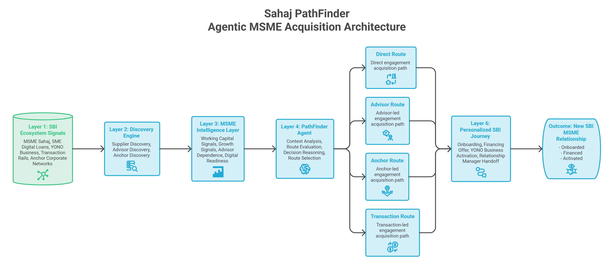
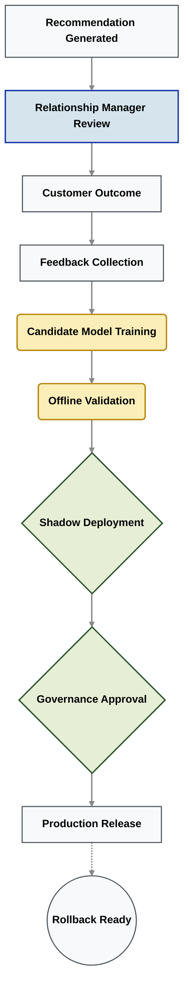

# System Architecture: Sahaj PathFinder
**Category:** Agentic MSME Acquisition Intelligence Platform

*A six-layer intelligence framework that transforms fragmented banking data into mathematically optimized, fully governed acquisition pathways.*

---

> ### **The Core Architectural Shift**
> Traditional acquisition systems ask: *"Which customer should we target?"*  
> **Sahaj PathFinder asks: *"Which acquisition pathway gives this specific MSME the highest probability of becoming an SBI customer and why?"***

## High-Level Architecture Overview

The architecture transforms fragmented ecosystem signals into explainable acquisition decisions through **six modular intelligence layers**. The prototype has been intentionally designed as a microservice-style architecture so that every layer can evolve independently without disrupting the overall business workflow.

---

## The 6 Intelligence Layers

| Layer | Component | Core Responsibility | Prototype Output |
| :--- | :--- | :--- | :--- |
| **1** | **SBI Ecosystem Signals** | Collects structured and unstructured ecosystem telemetry from existing banking relationships. | Invoices, *MSME Sahaj* records, UPI/NEFT/RTGS transactions, supplier ecosystems, advisor networks. |
| **2** | **Ecosystem Discovery Engine** | Discovers previously unseen, un-banked MSMEs hidden within existing customer ecosystems. | Supplier identified as a high-potential, net-new acquisition candidate. |
| **3** | **Signal Intelligence Engine** | Transforms raw ecosystem data into contextual, explainable business signals. | Working Capital Stress, Digital Readiness, Advisor Influence, Anchor Strength. |
| **4** | **Decision Intelligence Engine** | Evaluates multiple acquisition strategies simultaneously using deterministic weighted reasoning. | Ranks Transaction, Advisor, Anchor, and Direct routes with feature contributions and confidence scores. |
| **5** | **Acquisition Intelligence** | Generates explainable recommendations, personalized offers, and RM decision support. | Recommended acquisition route, product recommendation, offer draft, decision rationale, signal provenance. |
| **6** | **Continuous Learning & Governance**| Captures business outcomes, improves future recommendations, and governs production model evolution. | Feedback collection, model registry, shadow deployment, governance approval, rollback readiness. |

---

## The Four Autonomous Acquisition Routes

Instead of relying on a single, rigid lead-conversion funnel, PathFinder continuously evaluates four competing acquisition pathways before selecting the highest-confidence strategy.

| Route | Primary Trigger | Acquisition Strategy | Target SBI Offering |
| :--- | :--- | :--- | :--- |
| **Transaction Route** | Liquidity or working capital stress detected. | Solve an immediate financing requirement before pursuing broader banking adoption. | **MSME Sahaj Invoice Finance** |
| **Advisor Route** | Strong CA or financial advisor influence detected. | Acquire through trusted professional relationships already advising the business. | **SME Business Loan** |
| **Anchor Route** | Strong supply-chain dependency detected. | Expand from existing corporate banking relationships into surrounding supplier ecosystems. | **Supply Chain Finance** |
| **Direct Route** | High digital readiness & operational maturity. | Encourage self-service digital onboarding through SBI's digital channels. | **YONO Business Onboarding** |

*Each route is evaluated independently using explainable weighted scoring rather than opaque, black-box lead scoring.*

---

## Explainable Decision Architecture (XAI)

One of PathFinder's core design mandates is **absolute transparency**. Every recommendation presented to a Relationship Manager includes a comprehensive evidence trace:

*   **Signal Provenance:** Exactly where the data came from (e.g., specific invoice ID).
*   **Feature Contribution Analysis:** The weight of each variable in the final decision.
*   **Mathematical Scoring Logic:** Transparent formula calculations.
*   **Confidence Score:** Probabilistic certainty of conversion.
*   **Supporting Datasets:** Direct links to the underlying raw data.
*   **Route Comparison:** Why the winning route beat the alternatives.
*   **Decision History:** Previous interactions with the prospect ecosystem.

> **The Outcome:** Relationship Managers can understand precisely *how*, *why*, and *from which evidence* every single recommendation was produced.

---

## Governance, Registry & Continuous Learning

Enterprise banking requires AI systems that remain transparent, controllable, and continuously improving. Rather than allowing autonomous model evolution, PathFinder is restricted to a strictly governed deployment lifecycle.

This strict MLOps pipeline ensures that every production model is explainable, version-controlled, fully auditable, and instantly reversible.

---

## Prototype vs. Enterprise Evolution

The current prototype prioritizes deterministic reasoning and explainability while successfully demonstrating the complete acquisition workflow. Enterprise deployment seamlessly extends this architecture instead of replacing it.

| Capability Layer | Current Hackathon Prototype | SBI Enterprise Evolution |
| --- | --- | --- |
| **Orchestration** | Weighted Decision Engine | **LangGraph Supervisor** |
| **Graph Database** | NetworkX (In-Memory) | **Neo4j Enterprise** |
| **Data Ingestion** | CSV Dataset Simulation | **Kafka Event Streams** |
| **Explainability** | Signal Provenance Engine | **Enterprise XAI Services (LangSmith)** |
| **Model Registry** | Simulated Local Registry | **MLflow Enterprise Model Registry** |
| **Deployment** | Local FastAPI Services | **Distributed Kubernetes Microservices** |

*This incremental modernization strategy minimizes deployment risk while preserving established business logic and user workflows.*

---

## Core Architectural Principles

The platform is engineered around five non-negotiable principles:

1. **Explainability First:** Every recommendation is traceable to supporting evidence, source datasets, formulas, and confidence calculations.
2. **Human-in-the-Loop (HITL):** AI recommends. Relationship Managers approve. Execution *never* occurs without explicit human authorization.
3. **Governance Before Automation:** New models undergo offline validation, shadow deployment, governance review, and rollback readiness checks before ever reaching production.
4. **Continuous Learning:** Every customer interaction improves future recommendations through structured feedback loops while maintaining complete auditability.
5. **Modular Evolution:** Each architectural layer can evolve independently, enabling the prototype to transition gradually into an enterprise-scale SBI platform without disrupting existing operations.

---

## Conclusion

Sahaj PathFinder transforms fragmented ecosystem data into explainable acquisition intelligence through a modular, six-layer architecture. By combining ecosystem discovery, deterministic decision reasoning, human-in-the-loop governance, and continuous learning, the system eliminates blind marketing outreach.

*The prototype demonstrates the complete acquisition lifecycle today, while providing a realistic, enterprise-ready migration path toward a governed multi-agent platform operating securely at SBI scale.*