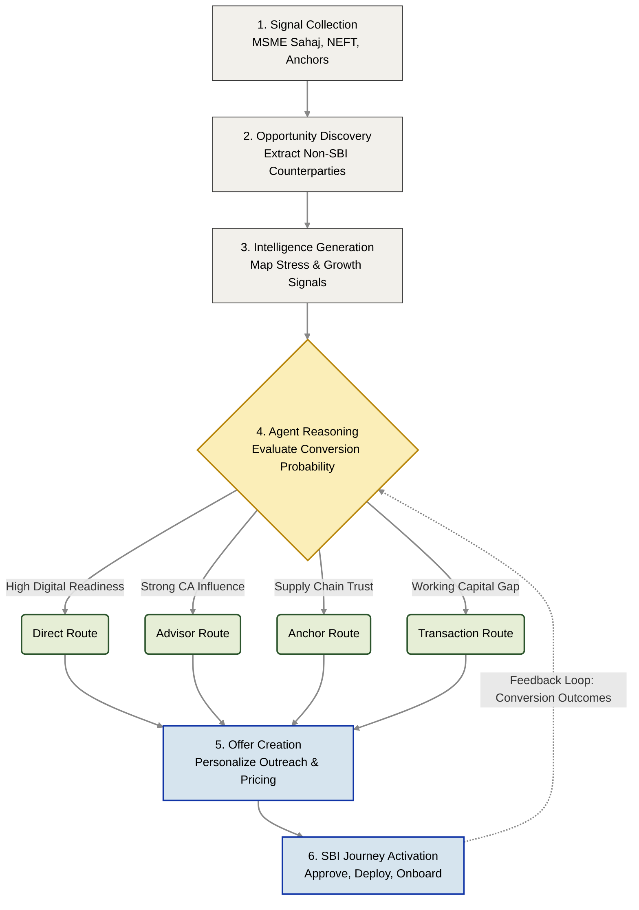

# Sahaj PathFinder: End-to-End System Flow

Sahaj PathFinder operates as an agentic acquisition intelligence system that transforms fragmented ecosystem signals into targeted acquisition actions. 

Instead of generating generic marketing leads, the system executes a continuous six-stage autonomous workflow.

## The Autonomous Acquisition Lifecycle

---

## The 6-Stage Execution Walkthrough

To understand the agent's logic, consider this real-world operational example:

### Step 1: Signal Collection

The platform continuously ingests disconnected signals from multiple SBI ecosystems, including invoice uploads from *MSME Sahaj*, transaction histories, existing supplier relationships, and corporate anchor networks. At this stage, the data is entirely fragmented.

### Step 2: Opportunity Discovery

The Discovery Engine parses these signals to identify unseen opportunities hiding in plain sight.

* **Example Trigger:** An existing SBI corporate customer uploads a payable invoice.
* **Discovery:** The system extracts the supplier, *Precision Castings Pvt Ltd*, and verifies they do not currently hold an SBI account. The system flags them as a new acquisition candidate.

### Step 3: Intelligence Generation

The Signal Intelligence Layer enriches this raw opportunity by analyzing historical data to build a comprehensive MSME profile:

* **Working Capital Stress:** Detects increasing payment delays and large pending receivables.
* **Growth Signals:** Detects increasing transaction volume.
* **Advisor Signals:** Identifies CA-led financial decisions.
* **Digital Readiness:** Assesses ERP adoption and existing digital workflows.

### Step 4: Agent Reasoning

Unlike a rule-based system that blindly pushes a lead to a CRM, the PathFinder Agent evaluates all available signals and simulates multiple acquisition strategies:

1. **Direct Route:** Offer digital onboarding immediately. *(Rejected: Low digital readiness).*
2. **Advisor Route:** Engage through trusted advisors. *(Rejected: Too slow for immediate need).*
3. **Anchor Route:** Use existing corporate relationships. *(Viable, but indirect).*
4. **Transaction Route:** Lead with a financing opportunity. *(Selected).*

* **Agent Rationale:** The Transaction Route is selected because *Precision Castings* shows acute working capital stress. An immediate liquidity offer yields the highest conversion probability with the lowest acquisition friction.

### Step 5: Personalized Offer Creation

Having selected the Transaction Route, the platform uses generative AI to draft a hyper-personalized engagement strategy tailored to the exact friction point.

* **Product:** MSME Sahaj Invoice Financing
* **Offer Amount:** ₹15 Lakh (Pre-calculated based on verified anchor invoices)
* **Expected Conversion:** 91%

### Step 6: SBI Journey Activation

The Relationship Manager reviews the AI's logic on a dashboard and clicks "Approve." The strategy launches a structured onboarding process:

> `Approve Strategy` → `Send Offer` → `Digital Onboarding` → `YONO Business Activation` → `Acquired Customer`

---

## The Learning Loop

Every decision the agent makes generates a feedback loop. By tracking outcomes (Conversion success, drop-offs, engagement quality, revenue generated), the system continuously learns:

* Which routes convert best for specific industries.
* Which hidden signals are the strongest predictors of switching banks.
* Which financial offers succeed in each segment.

---

## Why This Is Genuine Agentic AI

Most banking solutions rely on predictive classifiers. PathFinder relies on autonomous orchestration.

| Traditional Systems | Sahaj PathFinder |
| --- | --- |
| **Workflow:** `Input` → `Score` → `Action` | **Workflow:** `Input` → `Discover` → `Analyze` → `Reason` → `Compare` → `Select` → `Act` |
| **Classification:** Merely categorizes leads. | **Orchestration:** Evaluates multiple paths, chooses the most effective option, explains its reasoning, and self-improves. |

---

## Production Architecture Vision

To transition this from a hackathon prototype into a secure, enterprise-grade deployment at SBI:

* **Data Layer:** Direct ingestion from SBI transaction systems, MSME Sahaj, and YONO Business.
* **Graph Layer:** **Neo4j** or **TigerGraph** for modeling multi-tier supply chains.
* **Agent Layer:** **LangGraph** orchestrating secure, on-premise Enterprise LLMs (e.g., Llama-3) to ensure zero PII leakage and strict policy adherence.
* **Experience Layer:** Native integration into the internal RM Workbench and internal SBI acquisition dashboards.