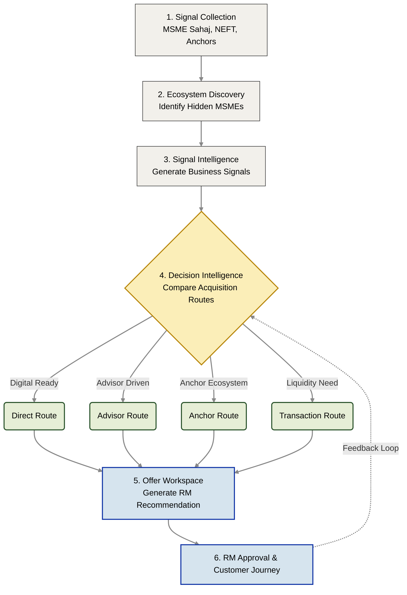

# End-to-End System Flow: Sahaj PathFinder
**Category:** Agentic MSME Acquisition Intelligence Platform

*A transparent, 6-stage operational pipeline transforming raw SBI ecosystem signals into high-conversion, fully governed acquisition journeys.*

---

## Executive Summary

**Sahaj PathFinder** is an Acquisition Intelligence Platform that transforms fragmented ecosystem signals into explainable, governed acquisition decisions. 

Rather than generating generic marketing leads that sit idly in a CRM, the platform operates as a continuous engine: discovering MSMEs, evaluating multiple acquisition pathways, recommending the optimal engagement strategy, supporting Relationship Manager decision-making, and learning from business outcomes through a strictly governed feedback loop.

---

## The Acquisition Intelligence Lifecycle

---

## Why This Architecture Is Different

| Feature | Traditional Acquisition | Sahaj PathFinder |
| --- | --- | --- |
| **Target Identification** | Lead scoring models | **Ecosystem discovery & extraction** |
| **Context** | Static CRM records | **Dynamic relationship graph reasoning** |
| **Strategy** | Single, fixed recommendation | **Multi-route parallel evaluation** |
| **Trust** | Black-box scoring | **100% Complete explainability (XAI)** |
| **RM Role** | Manual prioritization | **AI-assisted decision approval** |
| **Evolution** | Static models | **Governed continuous learning** |

*The platform is designed to augment Relationship Managers with superhuman context, rather than attempt to replace them.*

---

## Enterprise Evolution Target

The current prototype intentionally prioritizes deterministic reasoning, explainability, and governance. Production deployment will extend this architecture incrementally, minimizing operational risk while preserving auditability.

| Subsystem | MVP Prototype Execution | Enterprise Target Execution |
| --- | --- | --- |
| **Decision Engine** | Weighted Decision Engine | **LangGraph Supervisor** |
| **Graph Database** | NetworkX (In-Memory) | **Neo4j Enterprise** |
| **Data Ingestion** | CSV Dataset Simulation | **Kafka Event Streams** |
| **Model Registry** | Simulated Local Registry | **MLflow Enterprise Registry** |
| **Observability** | Internal Python Logging | **LangSmith + OpenTelemetry** |

---

## The 5 Engineering Principles

The architecture follows five non-negotiable principles throughout every stage of the workflow:

1. **Explainability First:** Every recommendation mathematically exposes its evidence, calculations, and confidence.
2. **Human-in-the-Loop:** Relationship Managers authorize and approve every single customer-facing action.
3. **Governance Before Automation:** Candidate models require offline validation, shadow deployment, and human board approval before entering production.
4. **Continuous Learning:** Business outcomes improve future recommendations through structured, labeled feedback.
5. **Incremental Modernization:** Enterprise capabilities replace prototype components gradually via microservices, without disrupting RM workflows.

---

## Conclusion

Sahaj PathFinder combines ecosystem discovery, explainable decision intelligence, governed AI, and continuous learning into a single, cohesive acquisition platform.

The current prototype demonstrates the complete acquisition lifecycle using deterministic reasoning and human oversight, while providing a realistic, derisked migration path toward an enterprise-scale, multi-agent architecture operating securely within SBI's massive ecosystem.