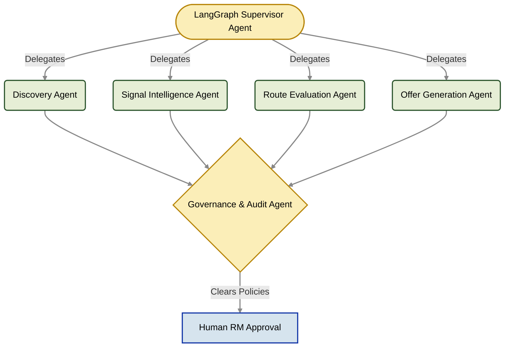
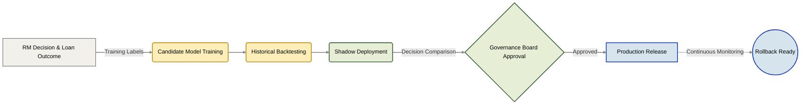

# Implementation Roadmap
**Sahaj PathFinder - From Functional Prototype to Enterprise Deployment**

*The roadmap illustrating how Sahaj PathFinder evolves from an Idea-Stage prototype into a highly governed, production-scale MSME Acquisition Platform.*

---

## Executive Overview

Sahaj PathFinder has progressed beyond the conceptual stage into a **working functional prototype** demonstrating the complete Acquisition Intelligence lifecycle. The current build successfully validates:

*   ✅ **Ecosystem Discovery** across synthetic ledgers.
*   ✅ **Explainable Signal Intelligence** (XAI).
*   ✅ **Weighted Route Decision Engine**.
*   ✅ **Offer Generation Workspace** (RM Approval UI).
*   ✅ **AI Governance & Shadow Deployment Protocols**.

The roadmap below details the exact engineering and governance steps required to migrate this prototype into a production-scale SBI platform - without ever sacrificing explainability, human oversight, or enterprise compliance.

---

## PHASE 0: The Functional Prototype (Current State)
*Status: **100% Completed** | Hackathon Milestone*

The current prototype demonstrates the complete end-to-end acquisition workflow using deterministic execution to guarantee zero hallucination during the evaluation phase.

| Stack Layer | Deployed Capabilities |
| :--- | :--- |
| **Platform** | `FastAPI` Backend, `Next.js` Frontend, `React Flow` UI, Synthetic relational datasets. |
| **Intelligence** | Discovery Engine, Signal Intelligence, Explainable Route Evaluation, Signal Provenance, Feature Contribution Analysis. |
| **Business Workflow**| Acquisition Dashboard, Opportunity Intelligence, RM Offer Workspace, Impact Center, AI Governance Dashboard. |
| **Explainability** | Formula inspection, Dataset traceability, Route comparison, Decision rationale, Confidence analysis. |
| **Enterprise Ready** | Continuous learning simulation, Model registry, Shadow deployment, Human-in-the-Loop (HITL) approval, Rollback strategy. |

---

## PHASE 1: Enterprise Data Integration
*Target: Weeks 1-2 | Objective: Replace synthetic datasets with controlled, live SBI data sources.*

*   **Secure Data Sources:** MSME Sahaj ledgers, SBI Corporate Banking, YONO Business telemetry, GSTN verification APIs, UPI/NEFT/RTGS transaction feeds.
*   **Compliance:** India Stack Account Aggregator (AA) framework integration for consented data access.

> **Data Pipeline Evolution:**
> **`CSV Ingestion`** ➔ **`Kafka Event Streams`** ➔ **`Automated Validation Layer`** ➔ **`Signal Processing`** ➔ **`Graph Storage`**

---

## PHASE 2: Graph Intelligence Platform
*Target: Weeks 2-3 | Objective: Scale ecosystem reasoning to support sub-second, multi-hop queries across millions of nodes.*

*   **Migration:** Transition from in-memory `NetworkX` to persistent **`Neo4j Enterprise`**.
*   **Enterprise Capabilities:** Multi-tier corporate ecosystems, deep supplier network mapping, hidden advisor relationships, Anchor cluster discovery, and algorithmic community detection.

---

## PHASE 3: Agentic Decision Engine
*Target: Weeks 3-4 | Objective: Replace the deterministic weighted prototype with a governed, multi-LLM LangGraph architecture.*

*The Supervisor coordinates specialist agents while preserving complete reasoning traces in LangSmith. **Human approval remains mandatory before any execution.***

---

## PHASE 4 & 5: Continuous Learning & Enterprise Governance

*Target: Weeks 4-5 | Objective: Deploy a strict MLOps pipeline where every acquisition becomes training data, but models are never promoted automatically.*

Enterprise AI requires controlled evolution. PathFinder introduces a governed learning pipeline that prevents model drift and ensures Risk Based Internal Audit (RBIA) compliance.

Every deployed model is guaranteed to remain: **Versioned**, **Explainable**, **Auditable**, **Reproducible**, and **Instantly Reversible**.

---

## PHASE 6: SBI Scale Deployment

*Target: Week 6+ | Objective: Expand beyond pilot branches into national acquisition infrastructure.*

* **Regional Rollout:** Branch-level deployment, regional performance monitoring, RM adoption analytics, localized strategy tuning.
* **National Rollout:** Multi-region Graph Intelligence, central MLflow model registry, enterprise observability, national acquisition intelligence dashboards.

---

## Technology Stack Evolution Matrix

To ensure zero architectural redesign during migration, the prototype will be built on modern frameworks that map 1:1 with their enterprise equivalents.

| Architecture Layer | Hackathon Prototype | SBI Enterprise Production |
| --- | --- | --- |
| **Frontend UI** | `Next.js` + `React Flow` | Micro-frontends embedded in **RM Workbench** |
| **Backend API** | `FastAPI` (Python) | **Spring Boot** / Python Enterprise Microservices |
| **Decision Engine** | Deterministic Weighted Rules | **LangGraph** Multi-Agent Supervisor |
| **Data Processing** | `Pandas` (Batch) | **Kafka** + **Apache Spark** (Streaming) |
| **Graph Database** | `NetworkX` (In-Memory) | **Neo4j Enterprise** |
| **Storage** | `CSV` + `SQLite` | **Enterprise PostgreSQL** |
| **AI Inference** | GPT-4o-mini (API) | Secure, On-Premise **SLMs (e.g., Llama-3)** |
| **Model Registry** | Simulated Local Registry | **MLflow** Enterprise |
| **Observability** | Internal Console Logs | **LangSmith** + **OpenTelemetry** |

---

## The 5 Implementation Principles

Regardless of the phase, the engineering team strictly adheres to the following enterprise mandates:

1. **Explainability First:** Every recommendation *must* expose its reasoning, supporting evidence, contributing signals, confidence score, and source datasets.
2. **Human-in-the-Loop (HITL):** Relationship Managers remain the absolute final decision authority. *AI recommends. Humans approve.*
3. **Governance Before Automation:** Models are never promoted automatically. Every release must survive offline validation, shadow deployment, and governance review.
4. **Continuous Learning:** Customer outcomes continuously refine future recommendations while maintaining absolute auditability.
5. **Incremental Modernization:** The production system evolves gracefully, augmenting existing RM workflows rather than disrupting them.

---

## **Prototype & Enterprise Roadmap Status**

| Project Component | Current Status |
| --- | --- |
| **Product Definition & Architecture** | ✅ Complete |
| **Interactive Prototype (Next.js + FastAPI)** | ✅ Complete |
| **Synthetic Data & Discovery Engine** | ✅ Complete |
| **Explainability & AI Governance** | ✅ Complete |
| **Continuous Learning Simulation** | ✅ Complete |
| **Enterprise Data Integrations (SBI APIs)** | 📌 Planned |
| **LangGraph Multi-Agent Orchestration** | 📌 Planned |
| **Neo4j Enterprise Knowledge Graph** | 📌 Planned |
| **MLflow / LangSmith Observability** | 📌 Planned |
| **Kubernetes & Production Deployment** | 📌 Planned |

---

## **Final Vision**

*Sahaj PathFinder is not intended to remain a hackathon prototype. The current repository establishes the complete acquisition intelligence workflow, proving technical and commercial viability ahead of the 30-day engineering sprint.*