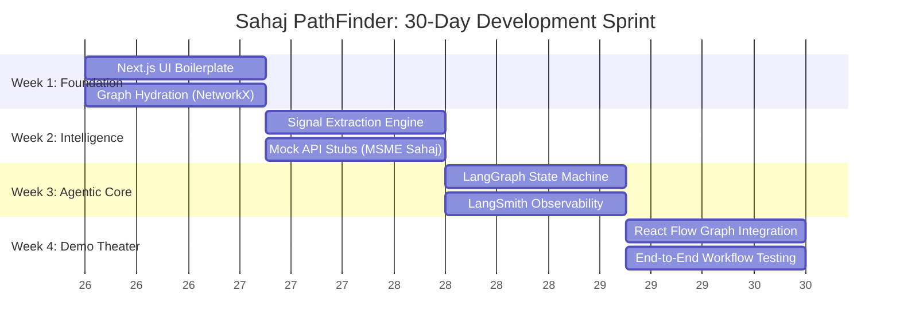

# Implementation Roadmap & Engineering Sprint

## Overview

This repository represents the **Idea Submission** phase of the SBI Global Fintech Fest 2026 Hackathon.

The roadmap below outlines the aggressive 30-day engineering sprint I will execute to transition **Sahaj PathFinder** from architectural blueprints into a fully functional, highly interactive prototype during the Development Phase.

---

## Hackathon Execution Timeline

### Phase 1: Idea Submission & Architecture Design

Our primary objective for this phase was to deliver a mathematically sound, commercially viable architectural blueprint, prioritizing business logic over premature coding.

* **Deliverables:** Problem Definition, Product Definition Document (PDD), Multi-Agent Architecture, High-Fidelity UI Prototypes, Relational Synthetic Datasets, Pitch Deck.
* **Status:** **COMPLETED**

### Phase 2: The 30-Day Engineering Sprint

If shortlisted, the team will execute a structured, 4-week agile sprint to deliver the interactive application.

#### Week 1 - Infrastructure & Graph Foundation

* **Frontend Setup:** Initialize the `Next.js` and `Tailwind CSS` repository for a high-performance Single Page Application (SPA).
* **Data Ingestion:** Build the Python ingestion scripts to parse the synthetic CSV ecosystem ledgers.
* **Graph Engine:** Initialize the `NetworkX` localized graph to map MSME counterparties, anchors, and advisors.

#### Week 2 - Signal Extraction & API Stubbing

* **Signal Intelligence:** Code the heuristic logic to extract *Working Capital Stress* and *Digital Readiness* from transactional volume.
* **Enterprise Integration Mocking:** Build JSON API stubs to simulate calls to **MSME Sahaj**, **YONO Business**, and public GSTN registries.

#### Week 3 - The PathFinder Agent & Guardrails

* **State Machine:** Implement the `LangGraph` multi-agent orchestration framework.
* **Prompt Engineering:** Design the system prompts for the four Acquisition Routes (Transaction, Advisor, Anchor, Direct).
* **XAI Tracing:** Implement `LangSmith` to provide visual, step-by-step observability into the LLM's reasoning for judging transparency.

#### Week 4 - Executive Experience & Presentation Polish

* **Interactive Visualization:** Implement `React Flow` to render dynamic, clickable ecosystem nodes directly in the browser.
* **Dashboard Integration:** Connect the Python/LangGraph backend to the Next.js frontend via FastAPI.
* **Demo Rehearsal:** Finalize the stage presentation and ensure zero-latency execution.

---

## Phase 3: Post-Hackathon Enterprise Evolution

Sahaj PathFinder is designed as a modular microservices platform. Following the hackathon, the architecture can scale to meet strict **RBIA (Risk Based Internal Audit)** compliance constraints:

| Capability | Hackathon Prototype | Enterprise Evolution |
| --- | --- | --- |
| **Data Ingestion** | Synthetic CSV Parsing | Real-time Kafka streaming from SBI transaction rails. |
| **Graph Database** | In-Memory `NetworkX` | Persistent `Neo4j` Enterprise deployment. |
| **LLM Inference** | Commercial API (GPT-4o-mini) | Secure, on-premise quantized SLMs (e.g., LLaMA-3). |
| **Data Validation** | Simulated Signals | India Stack **Account Aggregator (AA)** framework integration. |
| **User Interface** | Standalone Next.js App | Embedded module inside the internal **RM Workbench**. |

---

## Current Repository Status Matrix

| Project Component | Current Status | Notes |
| --- | --- | --- |
| **Problem Statement** | ✅ Complete | Validated against SBI core mandates. |
| **Product Definition (PDD)** | ✅ Complete | Features defined; MVP scope locked. |
| **Multi-Agent Architecture** | ✅ Complete | LangGraph & Tool-binding mapped. |
| **Synthetic Data Dictionary** | ✅ Complete | 12 relational datasets generated. |
| **UI Mockups / UX Flow** | ✅ Complete | High-fidelity executive screens designed. |
| **Demo Storyboard & Pitch** | ✅ Complete | Stage narrative finalized. |
| **Backend (Python/FastAPI)** | 📌 Planned | Scheduled for Sprint Week 1 & 2. |
| **Agent Engine (LangGraph)** | 📌 Planned | Scheduled for Sprint Week 3. |
| **Frontend (Next.js/React)** | 📌 Planned | Scheduled for Sprint Week 1 & 4. |

---

## The Guiding Principle

This repository currently focuses heavily on product design, data architecture, and commercial viability because the hackathon is currently in its **Idea Submission** stage. I personally believe that writing code without a flawless enterprise blueprint leads to brittle hackathon toys.

If shortlisted, I am technically equipped and fully prepared to convert this architecture into a production-grade, interactive application over the 30-day development window.