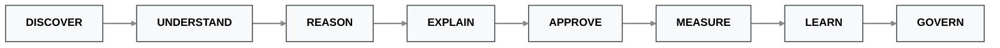

# Problem Statement: Sahaj PathFinder

**Category:** Agentic MSME Acquisition Intelligence Platform  
**Tagline:** *Every MSME Enters SBI Through a Different Door.*

---

## 1. Executive Summary

India's MSME sector represents one of the country's most critical economic growth engines, yet acquiring these high-value customers at scale remains one of the hardest systemic problems in corporate banking. 

State Bank of India (SBI) already possesses an enormous, unassailable competitive advantage. Through platforms such as **MSME Sahaj**, **SME Digital Loans**, **YONO Business**, existing corporate relationships, transaction rails, and supply-chain financing programs, SBI sits on a goldmine of commercial telemetry. 

> **The challenge is not a lack of data.** 
> The challenge is that these highly valuable signals exist in disconnected, siloed systems. This fragmentation makes it nearly impossible to dynamically discover acquisition opportunities, understand the granular business context, recommend the exact right engagement strategy, and continuously improve acquisition decisions over time. 

Consequently, highly trained Relationship Managers (RMs) burn thousands of hours manually identifying prospects, validating business credentials, guessing which products to pitch, and debating how each business should be approached. **Sahaj PathFinder** eliminates this operational drag by transforming fragmented ecosystem signals into governed, explainable Acquisition Intelligence.

---

## 2. The Core Problem: The Limits of Traditional CRMs

Traditional acquisition systems treat every prospect as just another flat record inside a CRM database. They are built to answer basic, top-of-funnel questions:
* *Which businesses match our eligibility criteria?*
* *Which customers have the highest aggregate lead score?*
* *Which opportunities should the call center contact first?*

While these questions are useful, they are vastly incomplete. Successful, high-conversion enterprise acquisition depends on answering far more difficult, multi-dimensional questions:

| The "Hard Questions" of Acquisition | Why Traditional Systems Fail |
| :--- | :--- |
| **Motivation:** *Why would this MSME choose SBI today?* | Requires detecting real-time operational stress, not just historical revenue. |
| **Product:** *What specific business problem should SBI solve first?* | Requires deep product mapping beyond generic account opening. |
| **Leverage:** *Which existing relationship should SBI leverage?* | Requires multi-tier supply chain and influence graph traversal. |
| **Pathway:** *Which acquisition strategy minimizes friction?* | Requires predicting behavioral readiness for digital vs. assisted channels. |
| **Conversion:** *Which SBI product creates the highest probability of success?*| Requires probabilistic simulation of multiple offers. |
| **Trust:** *Can this recommendation be fully explained and trusted?* | Requires transparent, deterministic AI, not black-box ML scoring. |

These decisions cannot be solved using static lead scoring. They require **continuous agentic reasoning** over dynamic business context.

---

## 3. The 5 Current Business Challenges

### 1. Hidden Ecosystem Opportunities (The Visibility Gap)
Thousands of un-banked MSMEs already interact with SBI indirectly every single day through:
* Invoice ecosystems (Payables/Receivables)
* Existing corporate customers (Tier 1/Tier 2 supply chains)
* Supplier networks
* Chartered Accountants and tax consultants
* Payment transactions (UPI/NEFT/RTGS)
* Ancillary banking relationships

These lucrative businesses remain largely invisible because current acquisition systems cannot synthesize fragmented ecosystem signals into cohesive, actionable opportunities.

### 2. One-Size-Fits-All Acquisition (The Friction Trap)
Most banking acquisition campaigns blindly assume every customer follows the exact same sales journey. In reality, the market is highly segmented:
* Some businesses face liquidity crunches and need working capital *immediately*.
* Some are highly conservative and trust *only* their Chartered Accountant.
* Some depend entirely on the operational portals of their *large corporate buyers*.
* Some are highly modern and prefer *fully digital, self-serve onboarding*.

Forcing a single, monolithic acquisition strategy upon all these profiles produces unnecessary friction, ignored outreach, and plummeting conversion rates.

### 3. Lack of Explainability (The "Black-Box" AI Problem)
Relationship Managers cannot confidently act on AI recommendations they cannot understand. Enterprise banking requires every systemic recommendation to answer:
* *Why was this company discovered?*
* *Which verified evidence supports this signal?*
* *Which specific datasets contributed to the logic?*
* *How exactly was the confidence score calculated?*
* *Why was one acquisition route selected over another?*

Without complete transparency and signal provenance, AI becomes an absolute liability in highly regulated financial environments.

### 4. Manual Decision Making (RM Operational Overload)
SBI's Relationship Managers spend deeply valuable, revenue-generating time performing repetitive, low-level analytical grunt work:
* Validating business identities.
* Comparing product fit matrices.
* Prioritizing overwhelming opportunity lists.
* Drafting and preparing customized proposals.
* Identifying suitable communication and acquisition routes.

This cognitive load limits pipeline velocity. Much of this work must be intelligently prepared by an agentic system *before* it ever reaches human review.

### 5. No Closed Learning Loop (Static Intelligence)
Traditional acquisition systems stop learning the moment a recommendation is pushed to the CRM. They suffer from a broken feedback loop, rarely capturing:
* RM overrides (Why did the human reject the AI?)
* Customer responses and engagement metrics.
* End-to-end onboarding outcomes.
* Post-acquisition loan performance.
* Subsequent ecosystem expansion.
* Successful cross-sell journeys.

Without capturing this structured telemetry, the bank's acquisition quality remains permanently static.

---

## 4. The Untapped SBI Opportunity

SBI already possesses the raw ingredients required to build the world's most intelligent acquisition platform. These proprietary assets include:
* **MSME Sahaj**
* **SME Digital Loans**
* **YONO Business**
* **Invoice ecosystems & transaction networks**
* **Corporate banking relationships & supply-chain finance programs**
* **Advisor ecosystems**

Rather than spending exorbitant marketing budgets searching externally for net-new businesses, SBI can continuously expand from its existing ecosystem by identifying the businesses *already operating within its gravitational pull*.

Every successful acquisition becomes the mathematical starting point for discovering the next one. This creates a **compounding ecosystem growth engine** (a network flywheel) rather than a series of isolated, linear acquisition campaigns.

---

## 5. Our Agentic Approach

Sahaj PathFinder transforms acquisition from a manual task into an autonomous, intelligence-driven workflow.

Instead of the broken legacy model (`Lead ➔ Score ➔ Call`), the platform executes a rigorous, 8-step enterprise lifecycle:

Operating as a continuous background orchestrator, the system:
* Discovers new MSMEs from transaction graphs.
* Constructs explainable business intelligence profiles.
* Evaluates multiple acquisition pathways simultaneously.
* Recommends the optimal, highest-converting SBI product.
* Prepares personalized, targeted offers.
* Supports Relationship Manager decisions with traceable evidence.
* Measures macro business outcomes.
* Learns from real-world feedback.
* Improves future recommendations through strictly governed model evolution.

---

### 6. Expected Business Impact

By deploying PathFinder, SBI will unlock measurable ROI across four strategic pillars:

### Measurable Impact & Outcomes Matrix

| Impact Category | Measurable Outcomes |
| :--- | :--- |
| **Customer Acquisition** | &bull; Discover previously hidden, un-banked MSMEs. &bull; Drastically increase outbound acquisition efficiency. &bull; Reduce Customer Acquisition Cost (CAC). &bull; Maximize Relationship Manager productivity. |
| **Digital Adoption** | &bull; Surge YONO Business platform adoption. &bull; Improve digital onboarding completion rates. &bull; Drive greater cross-product ecosystem usage. &bull; Eradicate offline onboarding friction. |
| **Digital Engagement** | &bull; Deliver hyper-personalized acquisition journeys. &bull; Increase customer engagement quality and trust. &bull; Mathematically improve conversion probability. &bull; Strengthen long-term, sticky banking relationships. |
| **AI Governance** | &bull; Guarantee complete recommendation explainability. &bull; Maintain end-to-end signal provenance. &bull; Enforce human approval (HITL) before execution. &bull; Execute continuous model evaluation & shadow deployments. &bull; Maintain version-controlled, rollback-ready production models. |

### 7. Conclusion

The future of MSME acquisition is not about generating a higher volume of low-quality leads. It is about continuously discovering hidden opportunities, understanding each business in its exact operational context, selecting the mathematically optimal acquisition pathway, explaining every recommendation with undeniable evidence, and improving future decisions through rigorously governed machine learning.

Sahaj PathFinder transforms SBI's acquisition strategy from traditional, blind lead management into a continuously learning, perfectly explainable, and fully enterprise-ready **Acquisition Intelligence Platform**.