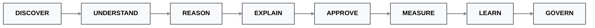

# Product Definition Document (PDD)

**Product Name:** Sahaj PathFinder  
**Category:** Agentic MSME Acquisition Intelligence Platform  
**Tagline:** *Every MSME Enters SBI Through a Different Door.*

---

## 1. Product Overview

**Sahaj PathFinder** is an enterprise-ready Agentic AI orchestration platform designed to help the State Bank of India (SBI) discover, understand, acquire, and continuously expand MSME relationships already hidden within its existing banking ecosystem.

Unlike traditional lead-generation systems that rely on static, one-size-fits-all scoring, PathFinder operates as a dynamic reasoning engine. It evaluates multiple competing acquisition strategies, routes opportunities through the mathematically optimal pathway, and explains every recommendation with strict evidence traceability.

> **The Core Principle:** The future of MSME acquisition is not discovering *more* leads. It is discovering the *right pathway* into every business.

---

## 2. Product Vision: From "Who" to "How"

The vision is to transform SBI's existing customers, transaction networks, invoice ecosystems, advisors, and supply-chain relationships into a self-sustaining, continuously expanding acquisition network.

| The Traditional Paradigm | The PathFinder Paradigm |
| :--- | :--- |
| **The Question:** *"Who should we target?"* | **The Question:** *"How should this specific MSME be acquired?"*|
| **The Method:** Monolithic Lead Scoring | **The Method:** Agentic Route Orchestration |
| **The Outcome:** Generic marketing push | **The Outcome:** Contextual, high-conversion pull |

---

## 3. Core Product Philosophy & Governance

Every recommendation generated by PathFinder follows an immutable, 8-stage enterprise lifecycle. This ensures that the AI remains transparent, auditable, and continuously improving under strict human oversight.

<kbd>**DISCOVER**</kbd> ➔ <kbd>**UNDERSTAND**</kbd> ➔ <kbd>**REASON**</kbd> ➔ <kbd>**EXPLAIN**</kbd> ➔ <kbd>**APPROVE**</kbd> ➔ <kbd>**MEASURE**</kbd> ➔ <kbd>**LEARN**</kbd> ➔ <kbd>**GOVERN**</kbd>

This lifecycle is hardcoded into the platform, from the Discovery Dashboard to the AI Governance Center, guaranteeing that PathFinder meets strict Risk Based Internal Audit (RBIA) compliance standards.

---

## 4. Strategic Objectives

| Strategic Pillar | Product Objective & Execution |
| :--- | :--- |
|**Customer Acquisition** | Discover MSMEs already interacting with SBI's network (via invoices/anchors) but not yet banking with SBI. |
|**Digital Adoption** | Match every discovered MSME with the most appropriate SBI digital product (e.g., *MSME Sahaj*, *YONO Business*). |
|**Digital Engagement** | Replace generic outbound marketing with highly context-aware, timed acquisition strategies personalized to each business. |
|**Explainable AI (XAI)** | Ensure every agentic recommendation traces back to supporting evidence, mathematical formulas, and verified source datasets. |
|**Enterprise Governance** | Enable safe, continuous learning through strict human-in-the-loop (HITL) approval, shadow deployments, and rollback controls. |

---

## 5. Target User Personas & Roles

### Execution & Operations
* **Relationship Managers (Primary):** Review AI-flagged acquisition opportunities, interrogate the AI's reasoning, approve/reject recommendations, and launch personalized acquisition journeys.
* **Acquisition Teams:** Monitor macro ecosystem discovery, track regional acquisition pipelines, and analyze route performance metrics.

### Leadership & Strategy
* **Regional & Business Heads:** Monitor aggregate conversion performance, measure geometric ecosystem expansion, evaluate RM effectiveness, and track overall AI ROI.

### Risk & Compliance
* **AI Governance Teams:** Review candidate ML models, approve production deployments, monitor model drift, validate shadow deployments, and maintain complete audit histories for regulators.

---

## 6. The 8-Stage Acquisition Intelligence Lifecycle

### Stage 1 - Discover
* **Agentic Action:** The platform continuously ingests multi-modal ecosystem signals, including *MSME Sahaj* invoice ledgers, existing SBI corporate relationships, advisor networks, and transaction rails (NEFT/RTGS).
* **Output:** Net-new, high-intent MSMEs currently hidden inside SBI's existing ecosystem.

### Stage 2 - Understand
* **Agentic Action:** The Discovery Engine constructs a multi-dimensional intelligence profile for every candidate.
* *Signals Extracted:* Working Capital Stress, Digital Readiness, Advisor Influence, Anchor Relationships, Growth Potential, Network Connectivity.
* *Traceability:* Every signal is permanently bound to its supporting dataset, confidence score, mathematical derivation, and underwriting evidence.
* **Output:** A complete, mathematically sound, explainable MSME Intelligence Profile.

### Stage 3 - Reason
* **Agentic Action:** The PathFinder Decision Engine evaluates all available acquisition strategies simultaneously. Rather than predicting a static score, the agent compares competing futures across four unique routes (Transaction, Advisor, Anchor, Direct) using deterministic weighted scoring.
* **Output:** Ranked acquisition strategies featuring precise feature-contribution analysis.

### Stage 4 - Explain
* **Agentic Action:** To eliminate "black-box AI" concerns, every recommendation is fully deconstructed. Relationship Managers can instantly inspect the feature contribution breakdown, decision rationale, signal provenance, formula calculations, and route comparison.
* **Output:** Total systemic transparency and compliance auditability.

### Stage 5 - Approve (Human-in-the-Loop)
* **Agentic Action:** The platform *never* executes autonomously. Relationship Managers hold absolute final decision authority. The system prepares the recommended product, personalized proposal, and onboarding strategy, halting execution until an authorized click occurs.
* **Output:** Compliant, RM-approved acquisition deployment.

### Stage 6 - Measure
* **Agentic Action:** Following deployment, PathFinder tracks real-world telemetry: acquisition success, conversion rates, loan book growth, downstream ecosystem discovery, operational efficiency, and RM adoption.
* **Output:** Measurable business outcomes linked directly to AI recommendations.

### Stage 7 - Learn
* **Agentic Action:** Every completed pipeline generates structured, labeled feedback (e.g., *RM accepted/overrode, Customer accepted/rejected, Loan activated/defaulted, Ecosystem expanded*). This data fuels the next generation of candidate models. Production models are never modified directly.
* **Output:** High-quality proprietary training data.

### Stage 8 - Govern
* **Agentic Action:** Enterprise AI demands controlled evolution. PathFinder utilizes a strict governed learning pipeline:
> `Feedback Collection` ➔ `Candidate Model Training` ➔ `Offline Validation` ➔ `Shadow Deployment` ➔ `Governance Review` ➔ `Production Release` ➔ `Rollback Ready`
* **Output:** Every production model remains versioned, auditable, explainable, and instantly reversible.

---

## 7. The Four Acquisition Routes

The system dynamically circumvents acquisition friction by routing prospects through their path of least resistance.

| Route | Trigger Signal | Primary Strategy | Typical SBI Product Match |
| :--- | :--- | :--- | :--- |
| **Transaction** | Severe liquidity/cash flow stress | Solve immediate working capital need | MSME Sahaj Invoice Finance |
| **Advisor** | Strong CA / Consultant influence | Acquire via the trusted financial advisor | SME Asset Loan |
| **Anchor** | Strong supply-chain dependency | Expand via the trusted anchor ecosystem | Supply Chain Finance |
| **Direct** | High digital readiness & maturity | Frictionless, digital self-service | YONO Business Onboarding |

---

## 8. MVP Scope vs. Enterprise Architecture

To ensure speed without sacrificing enterprise scale, the architecture separates the Hackathon Prototype from the Target State.

### Current Prototype (Hackathon Scope)
Demonstrates the complete acquisition intelligence workflow using deterministic execution.
* **Capabilities:** Ecosystem Discovery Engine, Signal Intelligence Engine, Explainable Weighted Decision Engine, Route Simulation Playground, Signal Provenance Engine, RM Approval Workflow, Impact Center, AI Governance Dashboard, Shadow Deployment Strategy.
* **Tech Stack:** `Next.js` (React), `FastAPI` (Python), `Pandas`, `NetworkX`, Deterministic Rule Engine.

### Enterprise Evolution (Target State)
Designed to evolve incrementally without breaking the established business workflow.
* **Tech Stack:** `Kafka` (Streaming), `Neo4j` Enterprise (Graph DB), `LangGraph` (Supervisor Agent), `MLflow` (Model Registry), `LangSmith` (LLM Observability), `PostgreSQL`, Secure On-Premise Enterprise LLMs.

---

## 9. Success Metrics & KPIs

PathFinder's success is tracked across five executive pillars:

* **Customer Acquisition:** Net-new MSMEs onboarded, Overall Conversion Rate, Total CAC (Customer Acquisition Cost) reduction.
* **Digital Adoption:** *YONO Business* activations, Digital onboarding completion rates, Cross-product adoption density.
* **Ecosystem Intelligence:** New network nodes discovered, Supply-chain expansion velocity, Total Graph volume growth.
* **AI Performance:** Recommendation Accuracy, RM Acceptance Rate (Hit Rate), False Positive Rate, Confidence Drift, Shadow Model vs. Production delta.
* **Governance:** Production model approvals, Rollback readiness, Audit completeness, Provenance coverage.

---

## 10. Conclusion & Differentiation

Traditional acquisition systems operate on a linear, reactive logic: `Input` ➔ `Score` ➔ `Action`.

**Sahaj PathFinder** shatters this paradigm by operating as a continuous loop:

This distinction upgrades the system from a simple lead-scoring tool into a self-improving, enterprise-grade **Acquisition Intelligence Platform**. Rather than attempting to replace Relationship Managers, PathFinder arms them with mathematically optimized, fully auditable recommendations that guarantee the right MSME is approached with the exact right strategy, at the exact right time.