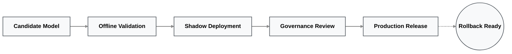

# Technology Stack: Sahaj PathFinder

**Category:** Agentic MSME Acquisition Intelligence Platform

*A deterministic, explainable prototype architecture designed for seamless migration into SBI's governed, multi-agent production infrastructure.*

---

## Executive Overview

Sahaj PathFinder is intentionally designed with a **two-stage architecture**.

The current prototype strictly prioritizes explainability, deterministic reasoning, rapid iteration, and an enterprise-grade user experience. The production architecture extends this foundation into a governed, multi-agent platform capable of operating securely within SBI's internal infrastructure.

This strict separation allows the prototype to remain fully auditable today while providing a realistic, zero-friction migration path toward enterprise deployment tomorrow.

---

## 1. Current Prototype Stack (Hackathon Scope)

The MVP is built on a modular, high-performance architecture engineered for speed, strict type safety, and 100% auditable enterprise logic.

### Architecture Stack Matrix

| Frontend | Backend | Intelligence (XAI) | Data Layer |
| :--- | :--- | :--- | :--- |
| • **Next.js 15** &bull; React • **TypeScript** &bull; Tailwind • **shadcn/ui** &bull; Framer • **React Flow** _(Graphs)_ • **Recharts** _(Dashboards)_ • **TanStack Query** | • **FastAPI** Framework • **Python 3.12** Core • **Pydantic** Validation • **Pandas** Processing • **Uvicorn** ASGI Server | • **Python + Pandas** Engine • **Rule-Based** Extraction • **Weighted** Scoring • **Signal** Provenance • **Feature** Contribution • **HITL** Workflows | • **12 Relational CSVs** • **NetworkX** Graphs • **Pandas** Ingestion • **PostgreSQL**  |

> [!NOTE]
> **The Deterministic Guarantee:** PathFinder **does not** rely on an LLM for business-critical decision making. The intelligence layer uses a 100% explainable reasoning engine to guarantee absolute mathematical trust, reproducible recommendations, and complete auditability.

---

## 2. Production Evolution (SBI Target State)

The enterprise architecture replaces prototype components incrementally while strictly preserving the core business logic.

| Capability | Hackathon Prototype | Enterprise Target |
| --- | --- | --- |
| **Decision Engine** | Deterministic Weighted Engine | **LangGraph Supervisor** |
| **Graph Intelligence** | NetworkX (In-Memory) | **Neo4j Enterprise** |
| **Data Processing** | Pandas (Batch) | **Apache Spark** |
| **Event Processing** | CSV Ingestion | **Apache Kafka** |
| **Persistent Storage** | CSV + Local SQLite | **PostgreSQL + Object Storage** |
| **AI Models** | Rule-based Reasoning | **Enterprise LLMs / SLMs** |
| **Model Governance** | Simulated Registry | **MLflow Registry** |
| **Observability** | Internal Logging | **LangSmith + OpenTelemetry** |
| **Deployment** | Local Prototype | **Kubernetes** |

---

## 3. Architecture Mapping

Every technology selected maps directly to a strict business capability, ensuring no "bloatware."

| Layer / Responsibility | Prototype Technology | Enterprise Evolution |
| --- | --- | --- |
| **Ecosystem Discovery:** *Discover hidden MSMEs* | Python + Pandas | Kafka + Spark |
| **Signal Intelligence:** *Generate business signals* | Rule Engine | Agentic Signal Analysis |
| **Graph Intelligence:** *Relationship reasoning* | NetworkX | Neo4j |
| **Route Evaluation:** *Compare acquisition strategies* | Weighted Decision Engine | LangGraph Supervisor |
| **Explainability:** *Decision traceability* | Signal Provenance Engine | LangSmith + Provenance APIs |
| **Offer Generation:** *RM recommendations* | FastAPI Services | Multi-Agent Orchestration |
| **Governance:** *Human approval & auditing* | Governance Engine | MLflow + Shadow Deployment |

---

## 4. AI Governance Stack

Enterprise AI requires far more than just accurate predictions. PathFinder incorporates strict Risk Based Internal Audit (RBIA) governance throughout the entire technology stack.

| Governance Capability | Prototype Execution | Enterprise Execution |
| --- | --- | --- |
| **Human Approval** | RM Approval UI Workflow | Integrated SBI Approval Policies |
| **Explainability** | Signal Provenance Engine | Enterprise XAI Services |
| **Model Registry** | Simulated Registry | MLflow Model Registry |
| **Shadow Deployment** | Simulated Evaluation | Production Shadow Inference |
| **Offline Validation** | Simulated Replay | Automated Backtesting Pipelines |
| **Rollback Strategy** | Version Simulation | One-Click Production Rollback |

---

## 5. Core Engineering Principles

The entire PathFinder platform was engineered from day one following five non-negotiable principles:

### 1. Explainability First

Every single recommendation can be traced back to its supporting signals, contributing features, confidence score, mathematical calculations, and source datasets.

### 2. Human-in-the-Loop (HITL)

PathFinder *recommends*. Relationship Managers *approve*. The platform is built to augment human financial expertise, never to autonomously replace it.

### 3. Governance Before Automation

No production model is ever promoted automatically. Production models must evolve through a strict pipeline:

### 4. Incremental Modernization

Prototype technologies can be replaced independently without changing business workflows. This microservices approach minimizes migration risk while allowing gradual enterprise adoption.

### 5. Enterprise Scalability

The architecture is intentionally modular. Every major subsystem (including graph intelligence, decision engines, AI orchestration, and storage) can evolve independently as SBI's deployment requirements mature.

---

## Conclusion

The current Sahaj PathFinder prototype prioritizes explainability, deterministic reasoning, and enterprise governance while successfully demonstrating the complete acquisition intelligence workflow.

Its highly modular architecture provides a clear, risk-free migration path from a hackathon prototype directly to a production-grade SBI platform, ultimately powered by governed multi-agent AI, real-time ecosystem intelligence, and enterprise-scale infrastructure.