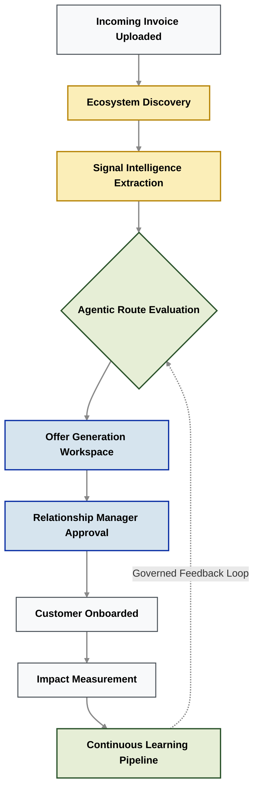

# Demo Storyboard: Sahaj PathFinder
**Category:** Agentic MSME Acquisition Intelligence Platform

*A high-impact, 5-minute executive walkthrough demonstrating how PathFinder transforms fragmented ecosystem data into governed, explainable acquisition decisions.*

---

## Demo Objective
Demonstrate how Sahaj PathFinder enables SBI Relationship Managers (RMs) to discover hidden MSME opportunities, understand the deep business context, recommend the mathematically optimal acquisition strategy, and measure long-term business impact, all through a single, 100% explainable workflow.

## The Demo Scenario
An existing SBI Tier-1 corporate customer uploads a massive batch of invoice data through the **MSME Sahaj** platform for clearance. 
*   **The Target:** One key supplier in that ledger (*Precision Chemicals Pvt. Ltd.*) is detected. They are **not** currently banking with SBI.
*   **The Difference:** Instead of dumping this name into a CRM as just another cold lead, Sahaj PathFinder dynamically evaluates whether this business should be acquired, determines the absolute best acquisition pathway, prepares a ready-to-launch recommendation for the RM, and tracks the long-term governance outcome.

---

## Screen 1: Executive Discovery Dashboard

### Narrative
The Relationship Manager starts the day by opening the Sahaj PathFinder portal. Rather than displaying hundreds of disconnected, low-intent leads, the dashboard highlights high-probability acquisition opportunities continuously discovered from within SBI's own transactional ecosystem.
The RM instantly grasps:
*   Acquisition pipeline health & conversion metrics.
*   Total ecosystem growth (Network Flywheel).
*   High-priority, AI-flagged opportunities.
*   Route distribution (Transaction, Advisor, Anchor, Direct).
*   Recent real-time discoveries.

### User Interaction
*   The presenter hovers over the ecosystem network graph, showing live nodes.
*   **Click** on the high-priority prospect: `Precision Chemicals Pvt. Ltd.` to investigate.

> **Emphasis:**
> *"Notice what is happening here: We are not spending marketing dollars searching outside SBI for prospects. We are using Graph Intelligence to discover highly lucrative businesses already transacting inside SBI's ecosystem."*

---

## Screen 2: Acquisition Intelligence (The XAI Layer)

### Narrative
The platform pulls back the curtain on the AI, explaining exactly *why* Precision Chemicals was discovered and *why* one specific acquisition strategy is mathematically superior to the others. Instead of presenting a single, opaque "lead score", PathFinder evaluates multiple futures simultaneously.
The RM reviews:
*   Discovery Score & Business Profile.
*   Extracted Business Signals (Liquidity, Digital Readiness, etc.).
*   Route Comparison (Head-to-head analysis of the 4 pathways).
*   Supporting Evidence & Signal Provenance (The data paper-trail).
*   Discovery Journey & Rejected Alternatives.

### User Interaction
*   **Expand** the *Working Capital Stress* signal and click **[Explain Signal]**.
*   *Show:* The specific contributing datasets, the supporting delayed transactions, the confidence score, and the underlying mathematical calculation.
*   **Expand** the *Transaction Route* explanation to show why it beat the *Advisor Route*.

> **Emphasis:**
> *"There is zero hallucination here. Every single recommendation is 100% transparent. The RM can inspect the exact invoice ledger and algorithmic math that triggered this recommendation before making any banking decision."*

---

## Screen 3: Offer Workspace (Human-in-the-Loop)

### Narrative
The selected acquisition strategy (Transaction Route) is seamlessly converted into an actionable, compliant proposal. The platform does the heavy lifting which includes preparing everything required for the RM, without ever removing human control.
The workspace presents:
*   The recommended SBI product (*MSME Sahaj Invoice Financing*).
*   Total opportunity value & dynamic pricing.
*   The core business objective.
*   RBIA Compliance checks & KYC readiness.
*   An AI-generated, hyper-personalized outreach draft.
*   Projected downstream ecosystem impact.

### User Interaction
*   Review the AI-generated proposal draft.
*   **Click [Approve Strategy]** to execute the Maker-Checker workflow.

> **Emphasis:**
> *"AI proposes; Humans dispose. The platform does the heavy analytical lifting, but the Relationship Manager remains the absolute final decision-maker. No spam is ever sent automatically."*

---

## Screen 4: Impact & Governance Center

### Narrative
The focus shifts from an individual micro-opportunity to macro portfolio performance. The RM now sees the cumulative business impact created by their approved strategies.
The dashboard highlights:
*   Acquisition performance & CAC reduction.
*   Route effectiveness & hit rates.
*   Ecosystem expansion (Geometric growth).
*   Business outcomes (Loan book growth).
*   Continuous learning feedback loop.
*   AI Governance status.

### User Interaction
*   **Expand** the *AI Governance & Continuous Learning* section.
*   Briefly demonstrate the feedback lifecycle, the Enterprise Model Registry, the Shadow Deployment metrics, and the strict production approval workflow.

> **Emphasis:**
> *"Every customer outcome improves our future recommendations, but only through strictly governed MLOps. We use shadow deployments and human-approved learning loops to ensure our AI never goes rogue."*

---

## The End-to-End System Workflow

---

## Final Message

Sahaj PathFinder changes the acquisition process from simply identifying businesses to determining the best way to acquire each one.

Rather than replacing Relationship Managers, it equips them with explainable intelligence, evidence-backed recommendations, and a continuously improving acquisition platform designed for enterprise banking.