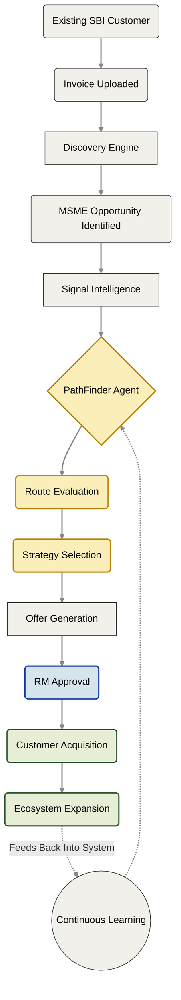

# Sahaj PathFinder: Demo Storyboard

**Demo Objective:** Demonstrate how SBI can transform MSME acquisition from a brute-force *lead-generation* problem into a precision *acquisition intelligence* problem.

**The Lifecycle:** `Discover` → `Understand` → `Decide` → `Acquire` → `Expand`

---

## The Demo Scenario

An existing SBI MSME customer uploads invoice information through **MSME Sahaj**. PathFinder autonomously discovers a supplier within that invoice who is *not* currently banking with SBI. The platform evaluates the supplier, determines the absolute most effective acquisition strategy, generates a personalized onboarding journey, and tracks the geometric business impact post-conversion.

---

## Screen 1: Discovery Dashboard

*The Relationship Manager (RM) opens Sahaj PathFinder to view the macro ecosystem.*

* **Narrative:** The dashboard continuously monitors ecosystem signals across all SBI channels. Instead of a list of cold leads, PathFinder has identified high-intent acquisition opportunities hiding within existing customer networks.
* **What the User Sees:** Total acquisition opportunities, Route distribution charts, High-priority MSMEs, Ecosystem growth indicators, and Discovery trends.
* **Demo Action:** The RM clicks on **Precision Castings Pvt Ltd** to investigate further.

> **The Takeaway:** PathFinder is not searching the internet for random leads. It is extracting guaranteed, high-intent opportunities already transacting inside SBI's infrastructure.

---

## Screen 2: Acquisition Intelligence

*PathFinder exposes its internal reasoning and evaluates the target MSME.*

* **Narrative:** The platform evaluates multiple unstructured signals to understand exactly *how* this specific business should be acquired.

**Signals Detected:**

* **Working Capital Stress:** Delayed invoice settlements suggest immediate liquidity needs.
* **Anchor Relationship:** Strong commercial ties with an SBI-connected anchor customer.
* **Advisor Influence:** Decision-making is influenced by an external Chartered Accountant.
* **Digital Readiness:** Moderate digital maturity with existing business systems.

**PathFinder Agent Route Evaluation:**

| Acquisition Route | Confidence Score | Agent Rationale |
| --- | --- | --- |
| **Transaction Route** | **91%** | *(Selected)* Working capital need creates the strongest, fastest conversion opportunity. |
| **Advisor Route** | 64% | CA influence exists, but liquidity is a more pressing pain point. |
| **Anchor Route** | 48% | Viable, but indirect. |
| **Direct Route** | 22% | Cold digital outreach will likely be ignored. |

> **The Takeaway:** The system does not merely categorize the opportunity. It mathematically reasons through multiple potential futures before selecting the optimum strategy.

---

## Screen 3: Acquisition Offer Workspace

*The platform generates the final strategy for human review.*

* **Narrative:** The agent transforms its analysis into a complete, deployable acquisition journey. The RM reviews the recommendation before launching.
* **What the User Sees:**
* **Recommended Product:** MSME Sahaj Invoice Financing
* **Opportunity Value:** ₹15 Lakh
* **Agent Decision Factors:** Working capital stress, strong anchor relationship, high financing relevance, low acquisition friction.
* **Compliance Review:** Verified—passes all required internal validation checks.

* **Demo Action:** The RM clicks **"Approve Strategy"**.

> **The Takeaway:** PathFinder bridges the gap between abstract analytics and immediate commercial action by generating a ready-to-deploy, compliant banking journey.

---

## Screen 4: Impact Center

*The strategy executes. The platform tracks the ripple effect.*

* **Narrative:** The RM tracks macro outcomes and observes how one acquisition geometrically expands the network.
* **What the User Sees:**
* **Business Outcomes:** Aggregate new MSMEs acquired, loan book growth, conversion rates, and acquisition efficiency (CAC reduction).
* **Ecosystem Expansion:** The conversion of *Precision Castings* instantly unlocks visibility into additional sub-tier MSMEs connected to their specific ledger.
* **Agent Insights & Learning Loop:** The system displays which routes are producing the highest success rates, continuously improving future routing decisions based on real-world outcomes.

> **The Takeaway:** One successful, targeted acquisition creates a geometric expansion of multiple future acquisition opportunities.

---

## The End-to-End System Flow

---

## Demo Success Matrix

| Core Capability | How it is Demonstrated |
| --- | --- |
| **Customer Acquisition** | Discovering un-banked MSMEs hidden entirely within SBI's existing ledgers. |
| **Digital Adoption** | Forcing the adoption of *MSME Sahaj*, Digital Loans, and *YONO Business* as a prerequisite to unlocking liquidity. |
| **Digital Engagement** | Delivering hyper-personalized outreach based on exact business context, not generic spam. |
| **Agentic AI** | Evaluating 4 distinct acquisition paths, selecting the highest-conversion route, and learning from the outcome. |

### The Final Message

Traditional banking systems ask: *"Who should we target?"*
**Sahaj PathFinder asks: *"How should we acquire them?"***
This fundamental shift transforms SBI from operating a static lead-generation funnel into a self-expanding, intelligent acquisition engine.