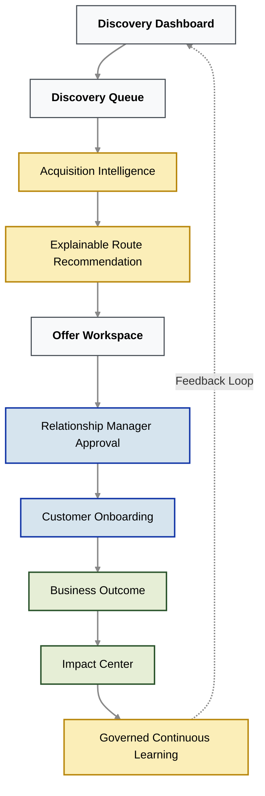

# Executive Platform Overview: Sahaj PathFinder
**Category:** Agentic MSME Acquisition Intelligence Platform

*This document provides a high-level overview of the Sahaj PathFinder prototype, illustrating the complete Relationship Manager workflow: from autonomous ecosystem discovery to governed AI learning.*

---

## Screen 1: Discovery Dashboard
**Core Purpose:** The executive command center for monitoring macro ecosystem growth, prioritizing high-value acquisition opportunities, and managing the continuous discovery pipeline.

| Key Feature | Operational Capability |
| :--- | :--- |
| **Discovery Queue** | Surfaces newly discovered MSMEs complete with discovery scores, confidence levels, validation status, and AI-recommended acquisition routes. |
| **Portfolio Intelligence** | Displays ecosystem-wide KPIs, including net-new opportunities, potential loan book value, conversion probabilities, and macro acquisition trends. |
| **Route Distribution** | Visualizes exactly how opportunities are distributed across the four core acquisition strategies: Transaction, Anchor, Advisor, and Direct. |
| **Discovery Timeline** | Tracks newly identified businesses, supplier relationships, and ecosystem expansion events in a strict chronological audit log. |
| **Operational Entry Point**| Allows Relationship Managers (RMs) to open the complete, deep-dive intelligence profile for any newly discovered opportunity. |

---

## Screen 2: Acquisition Intelligence (The XAI Layer)
**Core Purpose:** An explainable decision workspace exposing exactly *how* PathFinder discovered an MSME, *how* it evaluated every acquisition strategy, and *why* it produced its final recommendation.

| Key Feature | Operational Capability |
| :--- | :--- |
| **Discovery Intelligence** | Summarizes the discovery score, the discovery source, the MSME's position within the SBI ecosystem, and the strongest contributing operational signals. |
| **Route Evaluation Engine** | Compares all four acquisition routes head-to-head, mathematically explaining why one specific route outperformed every alternative. |
| **Signal Provenance** | Guarantees that every detected signal is fully traceable back to deterministic formulas, source datasets, supporting evidence, confidence scores, and underwriting records. |
| **Discovery Journey** | Visually maps every reasoning stage—from initial invoice detection through graph expansion and route evaluation—with expandable evidence available at every step. |
| **Ecosystem Context** | Maps anchor organizations, trusted advisors, suppliers, downstream opportunities, graph characteristics, and the estimated total ecosystem value unlocked by this acquisition. |
| **Human Oversight** | Records complete governance history, rejected alternatives, and previous Relationship Manager decisions to maintain absolute auditability. |

---

## Screen 3: Offer Workspace (Human-in-the-Loop)
**Core Purpose:** The human approval workspace where explainable AI recommendations are transformed into executable, compliant customer acquisition strategies.

| Key Feature | Operational Capability |
| :--- | :--- |
| **AI Strategy Recommendation** | Converts ecosystem intelligence into an optimal SBI product recommendation (e.g., *MSME Sahaj* or *YONO Business*) perfectly aligned with the customer's immediate business context. |
| **Risk & Compliance Validation**| Executes strict policy, eligibility, KYC, AML, and internal RBIA compliance checks *before* any customer interaction is permitted. |
| **Business Impact Projection** | Estimates the expected conversion probability, projected loan value, immediate ecosystem expansion, and downstream secondary acquisition opportunities. |
| **AI-Generated Outreach** | Produces highly personalized customer communication drafted entirely on verified operational signals, replacing generic, easily ignored product marketing. |
| **Execution Workflow** | Empowers Relationship Managers to approve, revise, escalate, or launch the complete onboarding journey while maintaining absolute human control over every decision. |

---

## Screen 4: Impact Center & Governance
**Core Purpose:** The executive analytics workspace dedicated to measuring realized business performance, geometric ecosystem expansion, and strictly governed AI evolution.

| Key Feature | Operational Capability |
| :--- | :--- |
| **Business Performance** | Tracks completed acquisitions, conversion rates, projected loan book growth, ecosystem expansion, and route effectiveness across the entire platform. |
| **Continuous Learning Pipeline** | Demonstrates exactly how production outcomes become labeled feedback signals that improve future recommendations through supervised machine learning. |
| **Governed AI Lifecycle** | Enforces enterprise model governance—including mandatory shadow deployment, offline validation, rollback readiness, and explicit human approval before any production promotion. |
| **Model Registry** | Maintains the version history, deployment status, evaluation metrics, approval records, and immutable audit trails for every production model. |
| **Enterprise Insights** | Measures how successful, targeted acquisitions geometrically expand the SBI ecosystem, generate secondary opportunities, and continuously improve future discovery quality. |

---

## Screen 5: Architecture Showcase
**Core Purpose:** A technical demonstration hub proving how Sahaj PathFinder evolves from a deterministic prototype into a highly scalable, production-grade multi-agent enterprise platform.

| Key Feature | Operational Capability |
| :--- | :--- |
| **Layered Architecture** | Explains every distinct operational stage—from signal ingestion and ecosystem discovery through route selection and customer outcomes. |
| **Interactive Simulation** | Demonstrates the deterministic weighted decision engine by allowing technical evaluators to modify live business signals and observe recommendation changes in real time. |
| **Production Migration Strategy**| Illustrates the controlled progression from formula-based reasoning to supervised multi-agent orchestration (utilizing offline validation, shadow deployment, governance approval, and rollback controls). |
| **Technology Blueprint** | Documents the current prototype stack alongside the planned target enterprise architecture for scalable deployment within SBI's infrastructure. |
| **Design Principles** | Highlights Explainability (XAI), graph-first discovery, human oversight (HITL), data privacy, continuous learning, and governed AI as the immutable foundations of the platform. |

---

## The End-to-End Operational Workflow

