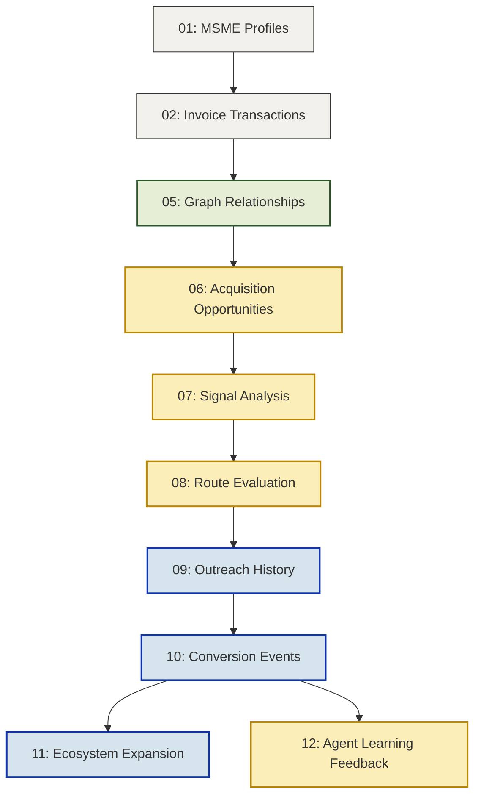

# Sahaj PathFinder - Synthetic Data Dictionary

## Overview

This directory contains the foundational synthetic datasets powering the **Sahaj PathFinder** platform.

These datasets simulate a living, breathing MSME banking ecosystem. They provide the necessary structured graph relationships, unstructured signal data, and state-tracking logs required to demonstrate multi-LLM routing, agentic decision-making, and dynamic UI rendering for the SBI Global Fintech Fest 2026 hackathon prototype.

> **Disclaimer:** All records contained within this directory are synthetically generated. No real customer, advisor, transaction, GST, or banking data is included.

---

## Dataset Architecture & Schemas

The data is normalized across 12 primary tables to simulate a scalable graph database architecture.

### 1. Entity & Transaction Layer

The foundational data ingested from existing SBI systems, simulating *MSME Sahaj* ledgers and onboarding data.

| Dataset | Core Purpose | Simulated Schema / Key Attributes |
| --- | --- | --- |
| `01_msme_profiles.csv`  | Master entity records defining target prospects and existing clients. | `msme_id`, `industry`, `annual_turnover`, `digital_readiness_score`, `geo_location` |
| `02_invoice_transactions.csv`  | Trade relationships exposing working capital gaps and payment delays. | `txn_id`, `payer_id`, `payee_id`, `amount`, `due_date`, `settlement_status` |

### 2. Network Intelligence Layer

Maps the external ecosystem to identify influence vectors and supply-chain dependencies.

| Dataset | Core Purpose | Simulated Schema / Key Attributes |
| --- | --- | --- |
| `03_anchor_relationships.csv`  | Maps Tier-2/Tier-3 MSMEs to large corporate anchors. | `msme_id`, `anchor_id`, `supply_tier`, `ltm_transaction_vol` |
| `04_advisor_relationships.csv`  | Maps MSMEs to specific Chartered Accountants and tax consultants. | `msme_id`, `advisor_id`, `engagement_type`, `influence_weight` |
| `05_graph_edges.csv`  | Unified edge list for graph visualization and centrality analytics. | `source_node`, `target_node`, `edge_type`, `interaction_frequency` |

### 3. Agentic Processing Layer

Logs the internal state, reasoning, and routing decisions made by the AI orchestration engine.

| Dataset | Core Purpose | Simulated Schema / Key Attributes |
| --- | --- | --- |
| `06_acquisition_opportunities.csv`  | Central ledger of all AI-flagged acquisition targets. | `opp_id`, `target_msme_id`, `est_conversion_value`, `status` |
| `07_opportunity_signals.csv`  | Extracted contextual triggers justifying outreach. | `opp_id`, `signal_type` (e.g., *Capital Stress*), `intensity_score` |
| `08_route_evaluation_results.csv`  | Confidence scores for all simulated paths to ensure AI explainability. | `opp_id`, `txn_score`, `advisor_score`, `anchor_score`, `direct_score`, `selected_route` |

### 4. Execution & Impact Layer

Tracks real-world outcomes, network ripple effects, and feedback for model tuning.

| Dataset | Core Purpose | Simulated Schema / Key Attributes |
| --- | --- | --- |
| `09_outreach_history.csv`  | Audit trail of generated campaigns and deployed offers. | `outreach_id`, `opp_id`, `channel_used`, `deployment_timestamp` |
| `10_customer_conversion_events.csv`  | Funnel tracking mapping outreach to final acquisition states. | `event_id`, `msme_id`, `outcome` *(Converted/Delayed/Rejected)*, `time_to_convert` |
| `11_ecosystem_expansion_tracking.csv`  | Measures geometric network growth unlocked post-conversion. | `parent_msme_id`, `new_nodes_discovered`, `projected_network_yield` |
| `12_agent_learning_feedback.csv`  | Closed-loop data used to adjust future route confidence scoring. | `run_id`, `predicted_outcome`, `actual_outcome`, `routing_delta` |

---

## Data Relationships & Execution Flow

---

## Prototype UI Mapping

The datasets are specifically structured to hydrate the frontend dashboards and simulate a live application environment.

### Screen 1: Discovery Dashboard

**Visualizes macro ecosystem volume and prioritizes the daily review queue.**

* **Driven By:** `01_msme_profiles.csv`, `05_graph_edges.csv`, `06_acquisition_opportunities.csv`

### Screen 2: Acquisition Intelligence

**Exposes the agent's internal logic, signal detection, and route selection rationale.**

* **Driven By:** `07_opportunity_signals.csv`, `08_route_evaluation_results.csv`

### Screen 3: Offer Workspace

**The executive interface for reviewing, editing, and launching generated campaigns.**

* **Driven By:** `06_acquisition_opportunities.csv`, `09_outreach_history.csv`

### Screen 4: Impact Center

**Tracks aggregate ROI, geometric network yield, and AI learning curves.**

* **Driven By:** `10_customer_conversion_events.csv`, `11_ecosystem_expansion_tracking.csv`, `12_agent_learning_feedback.csv`